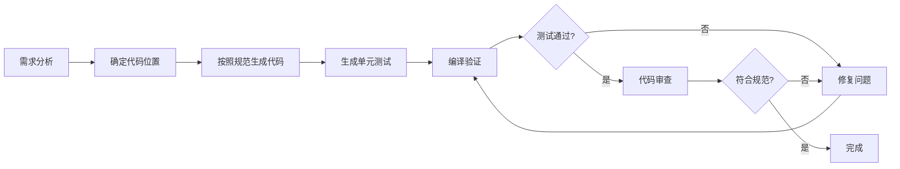

# CLAUDE.md - Java后端开发规范指南

> **核心理念**: 安全第一、性能优先、可维护性至上

本文档是 AI 辅助开发时的核心指南，定义了项目架构、编码规范、最佳实践和禁止事项。

---

## 📋 目录

1. [架构概览](#1-架构概览)
2. [编码基础规范](#2-编码基础规范)
3. [领域建模规范](#3-领域建模规范)
4. [数据持久化规范](#4-数据持久化规范)
5. [事件驱动机制](#5-事件驱动机制)
6. [分层开发规范](#6-分层开发规范)
7. [测试规范](#7-测试规范)
8. [代码设计原则](#8-代码设计原则)
9. [禁止事项](#9-禁止事项)
10. [代码生成流程](#10-代码生成流程)

---

## 1. 架构概览

### 1.1 核心架构模式

```
┌─────────────────────────────────────────────────────────┐
│                    接口层 (Adapter)                     │
│  Controllers、Listeners、外部API适配                      │
└────────────────────┬────────────────────────────────────┘
                     │
┌────────────────────▼────────────────────────────────────┐
│                   应用层 (Application)                   │
│  应用服务、用例编排、事务管理、DTO转换                    │
└────────────────────┬────────────────────────────────────┘
                     │
┌────────────────────▼────────────────────────────────────┐
│                   领域层 (Domain)                        │
│  聚合根、实体、值对象、领域服务、领域事件                  │
└────────────────────┬────────────────────────────────────┘
                     │
┌────────────────────▼────────────────────────────────────┐
│                 基础设施层 (Infrastructure)               │
│  数据库访问、外部服务、消息队列、配置管理                  │
└─────────────────────────────────────────────────────────┘
```

**依赖规则**: 依赖方向只能由外向内，外层可以引用内层，内层不感知外层

### 1.2 设计模式

| 模式                     | 说明       | 应用场景       |
|------------------------|----------|------------|
| **DDD**                | 领域驱动设计   | 核心业务逻辑建模   |
| **CQRS**               | 命令查询职责分离 | 复杂查询与写操作分离 |
| **Clean Architecture** | 清洁架构     | 分层隔离，依赖倒置  |
| **Event Sourcing**     | 事件溯源     | 领域事件溯源与重放  |

### 1.3 技术栈

| 分类       | 技术                  | 说明            |
|----------|---------------------|---------------|
| **核心框架** | Spring Boot 3.x     | 基础框架          |
| **持久层**  | MyBatis-Flex        | ORM框架         |
| **消息队列** | Kafka               | 事件驱动          |
| **缓存**   | Redis               | 分布式缓存         |
| **线程池**  | Virtual Threads     | Java 21+ 虚拟线程 |
| **配置管理** | Spring Boot Starter | 标准配置方式        |

### 1.4 包结构规范

```
org.smm.archetype
├── adapter/              # 适配层（接口层）
│   ├── access/          # 接入适配（Controller、Listener）
│   ├── repository/      # 仓储适配（如果需要）
│   └── config/          # 适配层配置
├── application/         # 应用层
│   ├── service/         # 应用服务
│   ├── command/         # 命令对象
│   ├── query/           # 查询对象
│   └── dto/            # 数据传输对象
├── domain/             # 领域层
│   ├── model/          # 领域模型
│   │   ├── aggregate/  # 聚合根
│   │   ├── entity/     # 实体
│   │   └── vo/         # 值对象
│   ├── service/        # 领域服务
│   ├── event/          # 领域事件
│   └── repository/     # 仓储接口
├── infrastructure/     # 基础设施层
│   ├── persistence/    # 持久化实现
│   ├── messaging/      # 消息中间件
│   ├── cache/          # 缓存实现
│   └── config/         # 基础设施配置
└── start/             # 启动模块
    └── resources/      # 配置文件
```

---

## 2. 编码基础规范

### 2.1 格式规范

| 规范项      | 要求      | 示例         |
|----------|---------|------------|
| **缩进**   | 4个空格    | ```java``` |
| **行长度**  | 最大120字符 | 超出需换行      |
| **文件编码** | UTF-8   | 无BOM       |
| **换行符**  | LF      | Unix风格     |

### 2.2 命名规范

| 类型      | 规范        | 示例                               |
|---------|-----------|----------------------------------|
| **类名**  | 大驼峰       | `UserService`                    |
| **接口名** | 大驼峰，可带I前缀 | `EmailService` 或 `IEmailService` |
| **方法名** | 小驼峰       | `getUserById`                    |
| **变量名** | 小驼峰       | `userId`                         |
| **常量名** | 大写+下划线    | `MAX_SIZE`                       |
| **包名**  | 全小写       | `org.smm.archetype.domain`       |

### 2.3 Lombok使用规范

**基本原则**: 精确控制代码生成，避免注解冲突

| 注解                         | 使用场景       | 注意事项                          |
|----------------------------|------------|-------------------------------|
| `@Data`                    | ❌ **禁止使用** | 生成代码不可控                       |
| `@Getter`                  | ✅ 允许       | 仅生成getter                     |
| `@Setter`                  | ✅ 允许       | 仅生成setter                     |
| `@Builder`                 | ✅ 推荐       | 构建复杂对象                        |
| `@SuperBuilder`            | ✅ 推荐       | 继承场景                          |
| `@RequiredArgsConstructor` | ✅ 推荐       | 依赖注入                          |
| `@AllArgsConstructor`      | ⚠️ 谨慎      | 可能与@Builder冲突                 |
| `@NoArgsConstructor`       | ⚠️ 谨慎      | 可能与@RequiredArgsConstructor冲突 |
| `@Slf4j`                   | ✅ 推荐       | 日志输出                          |

**推荐模式**:

```java
// ✅ 推荐：精确控制
@Getter
@Setter
@Builder(setterPrefix = "set")
public class UserDTO {

    private String userId;
    private String userName;

}

// ✅ 推荐：依赖注入
@RequiredArgsConstructor
public class UserServiceImpl implements UserService {

    private final UserRepository userRepository;

}

// ❌ 禁止：全包注解
@Data  // 禁止！
public class UserDTO {

    private String userId;

}
```

### 2.4 日志规范

- **必须使用**: `@Slf4j` 注解
- **日志级别**:
    - `ERROR`: 错误，需要立即处理
    - `WARN`: 警告，需要关注
    - `INFO`: 关键业务流程
    - `DEBUG`: 调试信息（生产环境关闭）

```java

@Slf4j
@Service
public class UserService {

    public void createUser(User user) {
        log.info("Creating user: userId={}", user.getUserId());
        try {
            // 业务逻辑
            log.debug("User created successfully: userId={}", user.getUserId());
        } catch (Exception e) {
            log.error("Failed to create user: userId={}", user.getUserId(), e);
            throw e;
        }
    }

}
```

### 2.5 线程池使用规范

**统一配置**: 使用 `ThreadPoolConfigure` 中的线程池

| 线程池                   | 类型   | 使用场景            |
|-----------------------|------|-----------------|
| `ioTaskExecutor`      | 虚拟线程 | IO密集型任务（数据库、网络） |
| `virtualTaskExecutor` | 虚拟线程 | 轻量级并发任务         |
| `cpuTaskExecutor`     | 平台线程 | CPU密集型任务（需注意）   |

```java

@Autowired
@Qualifier(ThreadPoolConfigure.IO_TASK_EXECUTOR)
private ExecutorService ioExecutor;

@Async(ThreadPoolConfigure.IO_TASK_EXECUTOR)
public void asyncTask() {
    // 异步任务
}
```

---

## 3. 领域建模规范

### 3.1 枚举设计规范

**核心原则**: 所有枚举字段必须标准化，禁止魔法值

#### 3.1.1 枚举识别规则

**字段语义包含（但不限于）以下关键词时，必须使用枚举**:

| 关键词       | 示例字段           | 枚举示例               |
|-----------|----------------|--------------------|
| type      | `userType`     | `UserEnum`         |
| status    | `orderStatus`  | `OrderStatusEnum`  |
| state     | `accountState` | `AccountStateEnum` |
| source    | `dataSource`   | `DataSourceEnum`   |
| business  | `businessType` | `BusinessTypeEnum` |
| errorCode | `errorCode`    | `ErrorCodeEnum`    |
| level     | `logLevel`     | `LogLevelEnum`     |
| mode      | `paymentMode`  | `PaymentModeEnum`  |

> 需要根据这个规则扩展，主动根据变量名语义及作用进行识别。

#### 3.1.2 枚举转换规则

**外部 → 内部**（反序列化）: 使用自带的`.valudOf(String str)`进行识别

```java
// ✅ 正确：带异常处理和默认值
public static OrderStatus fromString(String value) {
    try {
        return OrderStatus.valueOf(value);
    } catch (IllegalArgumentException e) {
        log.warn("Invalid OrderStatus: {}, using default: CREATED", value);
        return OrderStatus.CREATED;
    }
}

// ❌ 错误：直接使用魔法值
if("READY".

equals(status)){  // 禁止！
        // ...
        }
```

**内部 → 外部**（序列化）: 使用自带的`.name()`进行转换

```java
// ✅ 正确：使用枚举的name()
public String getStatus() {
    return orderStatus.name();  // 或 orderStatus.getCode()
}
```

**其他情况**: 除非有特殊用途，否则禁止使用重复性描述序列化/反序列化枚举

特殊用途举例：业务中无法获取XxxType类型，只能获取传入的类型，此时需要根据类名获取枚举

```java
import lombok.RequiredArgsConstructor;

@RequiredArgsConstructor
enum XxxEnum {

    // 这里示例根据类名获取，可以定义一个className来匹配枚举
    XxxType("xxxHandler")

    private final String className;

    // 根据类名获取枚举
    public static XxxEnum fromClassName(String className) {
        return java.util.Arrays.stream(values()).filter(e -> e.className.equals(className)).findFirst().orElse(null);
    }
    }
```

#### 3.1.3 枚举定义位置

**内部枚举**（定义在类内部）:

- 作为当前类的一部分（类比组合概念，不可拆分）
- 与当前类强耦合
- 不会作为API返回
- 简短的定义名称，如Status、Type、Usage、Scene等

```java
public class Product {

    public enum Status {
        IN_STOCK,
        OUT_OF_STOCK,
        PRE_ORDER
    }

    private Status availability;

}
```

**外部枚举**（独立文件）:

- 多个类共享（类比聚合概念，可拆分）
- 通用业务概念
- 在API中暴露
- 详细的定义名称，如OrderStatus，MessageType，BusinessSource等

```java
// domain/model/enums/OrderStatus.java
public enum OrderStatus {
    CREATED,
    PAID,
    SHIPPED,
    COMPLETED,
    CANCELLED
}
```

#### 3.1.4 枚举验证清单

生成代码前必须检查:

- [ ] 无魔法值，全部使用枚举
- [ ] 字段语义判断正确
- [ ] 枚举转换有异常处理
- [ ] 枚举定义位置正确
- [ ] 有默认值和日志

### 3.2 领域模型设计

#### 3.2.1 聚合根（Aggregate Root）

**特征**:

- 是聚合的入口点
- 维护聚合内部的一致性边界
- 拥有唯一标识

```java

@Getter
public class Order {

    private final OrderId         orderId;
    private       List<OrderItem> items;
    private       OrderStatus     status;

    // 业务行为
    public void addItem(Product product, int quantity) {
        // 业务规则验证
        if (status != OrderStatus.CREATED) {
            throw new IllegalStateException("Cannot add item to non-created order");
        }
        items.add(new OrderItem(product, quantity));
    }

    public void pay() {
        if (items.isEmpty()) {
            throw new IllegalStateException("Cannot pay empty order");
        }
        this.status = OrderStatus.PAID;
        // 发布领域事件
        registerEvent(new OrderPaidEvent(orderId));
    }

}
```

#### 3.2.2 实体（Entity）

**特征**:

- 有唯一标识
- 有生命周期
- 可变状态

```java

@Getter
@Setter
public class User {

    private UserId userId;
    private String userName;
    private Email  email;

    public void changeEmail(Email newEmail) {
        if (this.email.equals(newEmail)) {
            return; // 幂等性
        }
        this.email = newEmail;
        // 发送邮件变更事件
    }

}
```

#### 3.2.3 值对象（Value Object）

**特征**:

- 无唯一标识
- 不可变
- 可替换

```java

@Value
@Builder(setterPrefix = "set")
public class Email {

    String value;

    public static Email of(String email) {
        if (!isValid(email)) {
            throw new IllegalArgumentException("Invalid email: " + email);
        }
        return new Email(email.toLowerCase());
    }

    private static boolean isValid(String email) {
        return email != null && email.matches("^[A-Za-z0-9+_.-]+@(.+)$");
    }

}
```

### 3.3 领域事件

**事件命名规范**: 动词 + 名词 + 过去式后缀

| 事件类型 | 命名                  | 示例                      |
|------|---------------------|-------------------------|
| 已创建  | `XxxCreatedEvent`   | `OrderCreatedEvent`     |
| 已更新  | `XxxUpdatedEvent`   | `OrderUpdatedEvent`     |
| 已删除  | `XxxDeletedEvent`   | `OrderDeletedEvent`     |
| 已完成  | `XxxCompletedEvent` | `PaymentCompletedEvent` |

---

## 4. 数据持久化规范

### 4.1 DDL文件管理

**位置**: 项目根目录 `DDL-MySQL.sql`

**内容规范**:

- 每个表必须有注释
- 每个字段必须有注释
- 必须包含审计字段
- 必须定义索引

### 4.2 字段规范

#### 4.2.1 通用字段类型

| 业务含义   | 数据类型      | 长度  | 示例                               |
|--------|-----------|-----|----------------------------------|
| 主键ID   | `BIGINT`  | -   | `BIGINT NOT NULL AUTO_INCREMENT` |
| 用户ID   | `VARCHAR` | 64  | `VARCHAR(64) DEFAULT NULL`       |
| UUID   | `VARCHAR` | 64  | `VARCHAR(64)`                    |
| 业务类型   | `VARCHAR` | 32  | `VARCHAR(32)`                    |
| 状态     | `VARCHAR` | 32  | `VARCHAR(32)`                    |
| 枚举值    | `VARCHAR` | 32  | `VARCHAR(32)` **禁止使用ENUM类型**     |
| 服务名称   | `VARCHAR` | 128 | `VARCHAR(128)`                   |
| URL/路径 | `VARCHAR` | 512 | `VARCHAR(512)`                   |
| MD5/哈希 | `CHAR`    | 32  | `CHAR(32)`                       |
| 业务ID   | `VARCHAR` | 64  | `VARCHAR(64)`                    |

#### 4.2.2 审计字段（必须）

```sql
CREATE TABLE `xxx`
(
    -- 业务字段

    -- 审计字段（必须包含）
    `create_time` TIMESTAMP NOT NULL DEFAULT CURRENT_TIMESTAMP COMMENT '创建时间',
    `update_time` TIMESTAMP NOT NULL DEFAULT CURRENT_TIMESTAMP ON UPDATE CURRENT_TIMESTAMP COMMENT '更新时间',
    `delete_time` TIMESTAMP NULL     DEFAULT NULL COMMENT '删除时间',
    `create_user` VARCHAR(64)        DEFAULT NULL COMMENT '创建人ID',
    `update_user` VARCHAR(64)        DEFAULT NULL COMMENT '更新人ID',
    `delete_user` VARCHAR(64) NULL     DEFAULT NULL COMMENT '删除人ID'
) ENGINE=InnoDB DEFAULT CHARSET=utf8mb4 COMMENT='xxx表';
```

#### 4.2.3 索引命名规范

| 索引类型 | 命名格式             | 示例                         |
|------|------------------|----------------------------|
| 主键   | `PRIMARY`        | `PRIMARY KEY (id)`         |
| 唯一索引 | `uk_表名_字段名`      | `uk_order_order_no`        |
| 普通索引 | `idx_表名_字段名`     | `idx_order_user_id`        |
| 复合索引 | `idx_表名_字段1_字段2` | `idx_order_user_id_status` |

### 4.3 仓储模式

**接口定义**（Domain层）:

```java
public interface OrderRepository {

    Order save(Order order);

    Optional<Order> findById(OrderId orderId);

    List<Order> findByUserId(UserId userId);

    void delete(OrderId orderId);

}
```

**实现类**（Infrastructure层）:

```java

@Repository
@RequiredArgsConstructor
public class OrderRepositoryImpl implements OrderRepository {

    private final OrderMapper        orderMapper;
    private final DoConverterService doConverterService;

    @Override
    public Order save(Order order) {
        OrderDO orderDO = doConverterService.toOrderDO(order);
        orderMapper.insert(orderDO);
        return order;
    }

}
```

---

## 5. 事件驱动机制

### 5.1 事件发布架构

```
┌─────────────────────────────────────────────────────────┐
│                   领域层（Domain）                        │
│  ┌──────────────┐         ┌──────────────────────────┐  │
│  │ Aggregate    │────────▶│ DomainEvent              │  │
│  │ Root         │ publish  │ (OrderCreatedEvent)      │  │
│  └──────────────┘         └──────────────────────────┘  │
└─────────────────────────────────────────────────────────┘
         │
         │ EventPublisher
         ▼
┌─────────────────────────────────────────────────────────┐
│              基础设施层（Infrastructure）                 │
│  ┌──────────────────────────────────────────────────┐   │
│  │ EventPublisher Impl                               │   │
│  │  - AbstractEventPublisher                         │   │
│  │  - KafkaEventPublisher                            │   │
│  │  - SpringEventPublisher                           │   │
│  └──────────────────────────────────────────────────┘   │
└─────────────────────────────────────────────────────────┘
         │
         │ Kafka/Spring Event
         ▼
┌─────────────────────────────────────────────────────────┐
│                 适配层（Adapter）                         │
│  ┌──────────────────────────────────────────────────┐   │
│  │ EventListener                                      │   │
│  │  - KafkaEventListener                              │   │
│  │  - SpringEventListener                             │   │
│  └──────────────────────────────────────────────────┘   │
└─────────────────────────────────────────────────────────┘
```

### 5.2 事件发布流程

```java
// 1. 聚合根中发布事件
@Service
@RequiredArgsConstructor
public class OrderService {

    private final EventPublisher eventPublisher;

    @Transactional
    public void createOrder(Order order) {
        // 保存聚合
        orderRepository.save(order);

        // 收集并发布事件
        List<DomainEvent> events = order.getEvents();
        eventPublisher.publish(events);

        // 清空事件
        clearEvents();
    }

}
```

### 5.3 事件消费流程

```java

@Slf4j
@Component
public class OrderEventListener extends AbstractEventConsumer<OrderEvent> {

    @Override
    protected String getConsumerGroup() {
        return "order-consumer-group";
    }

    @Override
    @KafkaListener(topics = "order-events")
    public void onEvent(OrderEvent event) {
        // 父类实现幂等性、重试、状态管理
        consume(event);
    }

    @Override
    protected void doConsume(OrderEvent event, EventConsumeDO consumeDO) {
        // 业务处理逻辑
        // 处理成功会自动更新状态为CONSUMED
        // 处理失败会自动重试或标记为FAILED
    }

}
```

### 5.4 事件配置

```yaml
# application.yaml
event:
  publisher:
    type: kafka  # kafka 或 spring
  retry:
    cron: "0 * * * * ?"      # 每分钟执行一次
    batchSize: 100           # 每批次处理100个事件
    highPriorityRatio: 0.8   # 高优先级占比80%
```

### 5.5 事件状态管理

| 状态         | 说明   | 转换条件            |
|------------|------|-----------------|
| `READY`    | 准备消费 | 初始状态            |
| `CONSUMED` | 消费成功 | 业务处理成功          |
| `RETRY`    | 重试中  | 业务处理失败，未达最大重试次数 |
| `FAILED`   | 失败   | 达到最大重试次数        |

### 5.6 重试策略

**指数退避**: 1分钟 → 5分钟 → 15分钟 → 30分钟 → 60分钟

```java
private Instant calculateNextRetryTime(int retryTimes) {
    int[] delays = {1, 5, 15, 30, 60}; // 分钟
    int index = Math.min(retryTimes - 1, delays.length - 1);
    return Instant.now().plusSeconds(delays[index] * 60L);
}
```

---

## 6. 分层开发规范

### 6.1 接口层（Adapter）

**职责**:

- 接收外部请求
- 参数验证
- 调用应用服务
- 返回响应

```java

@RestController
@RequestMapping("/api/orders")
@RequiredArgsConstructor
public class OrderController {

    private final OrderApplicationService orderApplicationService;

    @PostMapping
    public Result<OrderVO> createOrder(@RequestBody @Valid OrderCreateRequest request) {
        // 1. 参数验证（通过@Valid）
        // 2. 调用应用服务
        Order order = orderApplicationService.createOrder(request);
        // 3. 转换为VO
        return Result.success(OrderVO.from(order));
    }

}
```

**禁止事项**:

- ❌ 直接调用Repository
- ❌ 包含业务逻辑
- ❌ 直接返回DO/Entity

### 6.2 应用层（Application）

**职责**:

- 用例编排
- 事务管理
- DTO转换
- 调用领域服务

```java

@ApplicationService
@RequiredArgsConstructor
public class OrderApplicationService {

    private final OrderRepository orderRepository;
    private final UserRepository  userRepository;
    private final EventPublisher  eventPublisher;

    @Transactional(rollbackFor = Exception.class)
    public Order createOrder(OrderCreateRequest request) {
        // 1. 验证用户存在
        User user = userRepository.findById(UserId.of(request.getUserId()))
                            .orElseThrow(() -> new UserNotFoundException(request.getUserId()));

        // 2. 创建订单（领域逻辑）
        Order order = Order.create(user, request.getItems());

        // 3. 保存聚合
        orderRepository.save(order);

        // 4. 发布事件
        eventPublisher.publish(order.getEvents());

        return order;
    }

}
```

**禁止事项**:

- ❌ 包含领域业务逻辑（应在领域层）
- ❌ 直接访问数据库（应通过Repository）
- ❌ 处理HTTP相关逻辑

### 6.3 领域层（Domain）

**职责**:

- 核心业务逻辑
- 业务规则验证
- 领域事件发布

**特点**:

- ✅ 纯净的业务逻辑
- ✅ 无外部依赖
- ✅ 可独立测试

### 6.4 基础设施层（Infrastructure）

**职责**:

- 数据持久化实现
- 外部服务集成
- 技术组件实现

**特点**:

- ✅ 不包含业务逻辑
- ✅ 可替换实现
- ✅ 依赖倒置（实现Domain定义的接口）

---

## 7. 测试规范

### 7.1 测试层级

```
┌─────────────────────────────────────────────────────────┐
│  E2E Tests (端到端测试) - 少量                            │
│  测试完整业务流程                                          │
└─────────────────────────────────────────────────────────┘
         │
┌─────────────────────────────────────────────────────────┐
│  Integration Tests (集成测试) - 适量                      │
│  测试组件协作                                             │
└─────────────────────────────────────────────────────────┘
         │
┌─────────────────────────────────────────────────────────┐
│  Unit Tests (单元测试) - 大量                             │
│  测试单一行为                                             │
└─────────────────────────────────────────────────────────┘
```

### 7.2 单元测试规范

**要求**:

- 每个Service/Domain Service必须有单元测试
- 覆盖核心业务逻辑
- 覆盖正常分支和异常分支

```java

@ExtendWith(MockitoExtension.class)
class OrderServiceTest {

    @Mock
    private OrderRepository orderRepository;

    @InjectMocks
    private OrderService orderService;

    @Test
    @DisplayName("创建订单 - 成功")
    void createOrder_Success() {
        // Given
        OrderCreateRequest request = OrderCreateRequest.builder()
                                             .userId("user123")
                                             .items(List.of(new OrderItem("product1", 2)))
                                             .build();

        User user = new User(UserId.of("user123"));

        when(userRepository.findById(any())).thenReturn(Optional.of(user));

        // When
        Order order = orderService.createOrder(request);

        // Then
        assertNotNull(order);
        assertEquals(OrderStatus.CREATED, order.getStatus());
        verify(orderRepository, times(1)).save(any(Order.class));
    }

    @Test
    @DisplayName("创建订单 - 用户不存在")
    void createOrder_UserNotFound() {
        // Given
        OrderCreateRequest request = OrderCreateRequest.builder()
                                             .userId("non-existent")
                                             .build();

        when(userRepository.findById(any())).thenReturn(Optional.empty());

        // When & Then
        assertThrows(UserNotFoundException.class, () -> {
            orderService.createOrder(request);
        });
    }

}
```

### 7.3 测试命名规范

```java
// 格式: 方法名_场景_预期结果
@Test
void createUser_Success() {}

@Test
void createUser_UserAlreadyExists_ThrowsException() {}

@Test
void deleteUser_UserNotFound_ReturnsFalse() {}
```

---

## 8. 代码设计原则

### 8.1 SOLID原则

| 原则           | 说明          | 示例                   |
|--------------|-------------|----------------------|
| **S** - 单一职责 | 一个类只负责一件事   | UserService只负责用户相关逻辑 |
| **O** - 开闭原则 | 对扩展开放，对修改关闭 | 使用接口+实现              |
| **L** - 里氏替换 | 子类可替换父类     | 子类不违反父类契约            |
| **I** - 接口隔离 | 接口小而专注      | 拆分大接口                |
| **D** - 依赖倒置 | 依赖抽象而非具体    | 依赖接口而非实现类            |

### 8.2 接口实现分离

**原则**: 通用服务必须定义接口

```java
// ✅ 正确：接口+实现
public interface EmailService {
    void sendEmail(String to, String subject, String content);
}

@Service
public class SmtpEmailServiceImpl implements EmailService {
    @Override
    public void sendEmail(String to, String subject, String content) {
        // SMTP实现
    }

}

// ❌ 错误：直接使用实现类
@Service
public class EmailService {  // 缺少接口

    public void sendEmail(String to, String subject, String content) {
        // 实现
    }
}
```

### 8.3 依赖注入原则

**使用构造函数注入**:

```java
// ✅ 正确：构造函数注入
@Service
@RequiredArgsConstructor  // Lombok自动生成构造函数
public class UserServiceImpl implements UserService {
    private final UserRepository userRepository;
    private final EmailService emailService;

}

// ❌ 错误：字段注入
@Service
public class UserServiceImpl implements UserService {

    @Autowired
    private UserRepository userRepository;  // 不推荐

}

// ❌ 错误：Setter注入
@Service
public class UserServiceImpl implements UserService {

    @Autowired
    public void setUserRepository(UserRepository userRepository) {
        this.userRepository = userRepository;
    }

}
```

---

## 9. 禁止事项

### 9.1 代码层面

| 禁止项                        | 说明     | 正确做法                 |
|----------------------------|--------|----------------------|
| ❌ Controller直接调用Repository | 违反分层原则 | 通过ApplicationService |
| ❌ Service层处理HTTP请求         | 职责混乱   | HTTP处理在Adapter层      |
| ❌ 硬编码配置值                   | 不易维护   | 使用配置文件               |
| ❌ 使用System.out.println     | 缺乏日志管理 | 使用@Slf4j             |
| ❌ 空catch块                  | 吞噬异常   | 至少记录日志               |
| ❌ 在循环中查询数据库                | N+1问题  | 批量查询                 |
| ❌ 大事务操作                    | 锁定时间长  | 拆分小事务                |
| ❌ 过度使用synchronized         | 性能问题   | 使用分布式锁               |

### 9.2 安全层面

| 禁止项         | 说明    | 正确做法           |
|-------------|-------|----------------|
| ❌ 日志记录敏感信息  | 泄露风险  | 脱敏处理           |
| ❌ 明文存储密码    | 安全风险  | BCrypt加密       |
| ❌ 客户端存储敏感凭证 | XSS风险 | 服务端Session     |
| ❌ 使用不安全随机数  | 可预测性  | 使用SecureRandom |
| ❌ SQL拼接     | SQL注入 | 使用参数化查询        |
| ❌ 直接反射用户输入  | RCE风险 | 白名单验证          |

### 9.3 性能层面

| 禁止项         | 说明       | 正确做法     |
|-------------|----------|----------|
| ❌ 循环中查数据库   | N+1问题    | 批量查询/缓存  |
| ❌ 不必要的对象创建  | GC压力     | 复用对象/对象池 |
| ❌ 过度锁粒度     | 并发性能降低   | 缩小锁范围    |
| ❌ 阻塞IO在虚拟线程 | 虚拟线程优势丧失 | 使用NIO    |
| ❌ 不分页查询大表   | OOM风险    | 强制分页     |

### 9.4 架构层面

| 禁止项         | 说明                                     |
|-------------|----------------------------------------|
| ❌ 内层依赖外层    | 违反依赖倒置                                 |
| ❌ 领域层依赖基础设施 | 领域层应保持纯净                               |
| ❌ 跨层访问      | 遵循分层调用链                                |
| ❌ 修改生成代码    | `infrastructure._shared.generated`禁止修改 |

---

## 10. 代码生成流程

### 10.1 生成步骤



### 10.2 生成检查清单

**必须全部通过**:

- [ ] **编译通过**: 无编译错误
- [ ] **测试通过**: 单元测试全部通过
- [ ] **分层正确**: 依赖方向正确
- [ ] **接口分离**: 通用服务有接口
- [ ] **枚举标准**: 无魔法值
- [ ] **日志规范**: 使用@Slf4j
- [ ] **注释完整**: public方法有Javadoc
- [ ] **禁止项检查**: 不违反任何禁止事项
- [ ] **数据库规范**: 符合字段规范
- [ ] **配置规范**: 使用统一线程池

### 10.3 质量标准

| 维度       | 标准        |
|----------|-----------|
| **正确性**  | 逻辑正确，测试覆盖 |
| **可读性**  | 命名清晰，结构合理 |
| **可维护性** | 低耦合，高内聚   |
| **性能**   | 无明显性能问题   |
| **安全性**  | 无安全漏洞     |

---

## 附录A: 常用工具类

### A.1 线程池配置

```java

@Autowired
@Qualifier(ThreadPoolConfigure.IO_TASK_EXECUTOR)
private ExecutorService ioExecutor;

@Autowired
@Qualifier(ThreadPoolConfigure.VIRTUAL_TASK_EXECUTOR)
private ExecutorService virtualExecutor;
```

### A.2 DTO转换工具

```java
// DoConverterUtils - DO与DTO转换
UserDTO userDTO = DoConverterUtils.toDTO(userDO, UserDTO.class);
```

### A.3 枚举工具

```java
// EnumUtils - 枚举转换
OrderStatus status = EnumUtils.valueOf(OrderStatus.class, "CREATED");
```

---

## 附录B: 常见问题FAQ

### Q1: 如何选择枚举定义位置？

**A**: 判断是否跨类使用：

- 仅当前类用 → 内部枚举
- 多个类共用 → 外部枚举

### Q2: 何时使用事务？

**A**:

- ✅ 需要原子性的写操作
- ✅ 跨多个Repository的操作
- ❌ 只读查询（不需要）
- ❌ 跨微服务调用（使用分布式事务）

### Q3: 如何处理循环依赖？

**A**:

- 重新设计职责划分
- 提取公共接口
- 使用事件驱动解耦

---

**文档版本**: v2.0
**最后更新**: 2026-01-09
**维护者**: Leonardo
