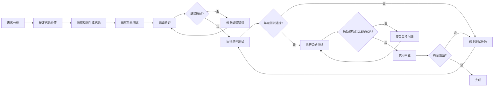

# CLAUDE.md - Java后端开发规范指南

> **核心理念**: 安全第一、性能优先、可维护性至上

本文档是 AI 辅助开发时的核心指南，定义了项目架构、编码规范、最佳实践和禁止事项。

---

# 🚨 快速参考

## 测试运行命令速查

```bash
# ===== 启动测试（最关键）=====
mvn test -Dtest=ApplicationStartupTests -pl start

# ===== 编译验证 =====
mvn clean compile

# ===== 单元测试 =====
mvn test

# ===== 生产环境运行（会一直运行）=====
mvn spring-boot:run -pl start
```

## 4步强制验证流程

| 步骤  | 命令                                                  | 验证目标     | ✅ 成功标志                               |
|-----|-----------------------------------------------------|----------|--------------------------------------|
| 1️⃣ | 编写单元测试                                              | 覆盖核心逻辑   | 测试类已创建                               |
| 2️⃣ | `mvn clean compile`                                 | 编译验证     | `BUILD SUCCESS`                      |
| 3️⃣ | `mvn test`                                          | 单元测试验证   | Tests run > 0, Failures: 0           |
| 4️⃣ | `mvn test -Dtest=ApplicationStartupTests -pl start` | **启动验证** | Tests run: 1, Failures: 0, Errors: 0 |

> **⚠️ 提醒**: 详细验证流程和故障排查见[第10章 代码生成流程](#10-代码生成流程)

---

## 📋 目录

1. [架构概览](#1-架构概览)
2. [编码基础规范](#2-编码基础规范)
3. [领域建模规范](#3-领域建模规范)
4. [数据持久化规范](#4-数据持久化规范)
5. [事件驱动机制](#5-事件驱动机制)
6. [分层开发规范](#6-分层开发规范)
7. [测试规范](#7-测试规范)
8. [代码设计原则](#8-代码设计原则)
9. [禁止事项](#9-禁止事项)
10. [代码生成流程](#10-代码生成流程)
11. [中间件接入层](#11-中间件接入层)
12. [附录A: 常见问题FAQ](#附录a-常见问题faq)
13. [附录B: 模式参考示例](#附录b-模式参考示例)

---

## 1. 架构概览

### 1.1 核心架构模式

```
┌─────────────────────────────────────────────────────────┐
│                    接口层 (Adapter)                     │
│  Controllers、Listeners、外部API适配                      │
└────────────────────┬────────────────────────────────────┘
                     │
┌────────────────────▼────────────────────────────────────┐
│                   应用层 (Application)                   │
│  应用服务、用例编排、事务管理、DTO转换                    │
└────────────────────┬────────────────────────────────────┘
                     │
┌────────────────────▼────────────────────────────────────┐
│                   领域层 (Domain)                        │
│  聚合根、实体、值对象、领域服务、领域事件                  │
└────────────────────┬────────────────────────────────────┘
                     │
┌────────────────────▼────────────────────────────────────┐
│                 基础设施层 (Infrastructure)               │
│  数据库访问、外部服务、消息队列、配置管理                  │
└─────────────────────────────────────────────────────────┘
```

**依赖规则**: 依赖方向只能由外向内，外层可以引用内层，内层不感知外层

### 1.2 设计模式

| 模式                     | 说明       | 应用场景       |
|------------------------|----------|------------|
| **DDD**                | 领域驱动设计   | 核心业务逻辑建模   |
| **CQRS**               | 命令查询职责分离 | 复杂查询与写操作分离 |
| **Clean Architecture** | 清洁架构     | 分层隔离，依赖倒置  |
| **Event Sourcing**     | 事件溯源     | 领域事件溯源与重放  |

### 1.3 技术栈

> **注**: 本项目使用以下技术栈，但规范设计时考虑了可替换性

| 分类       | 技术                  | 说明                    |
|----------|---------------------|-----------------------|
| **核心框架** | Spring Boot 3.x     | 基础框架                  |
| **持久层**  | MyBatis-Flex        | ORM框架（可替换为JPA等）       |
| **消息队列** | Kafka               | 事件驱动（可替换为RabbitMQ等）   |
| **缓存**   | Redis               | 分布式缓存（可替换为Hazelcast等） |
| **线程池**  | Virtual Threads     | Java 21+ 虚拟线程         |
| **配置管理** | Spring Boot Starter | 标准配置方式                |

**技术选型原则**:

- 优先选择标准技术栈，避免vendor lock-in
- 通过接口隔离实现技术可替换性
- 新技术选型需咨询团队决策

---

## 2. 编码基础规范

### 2.1 格式规范

| 规范项      | 要求      | 示例         |
|----------|---------|------------|
| **缩进**   | 4个空格    | ```java``` |
| **行长度**  | 最大120字符 | 超出需换行      |
| **文件编码** | UTF-8   | 无BOM       |
| **换行符**  | LF      | Unix风格     |

### 2.2 命名规范

| 类型      | 规范        | 示例                               |
|---------|-----------|----------------------------------|
| **类名**  | 大驼峰       | `XxxService`                     |
| **接口名** | 大驼峰，可带I前缀 | `EmailService` 或 `IEmailService` |
| **方法名** | 小驼峰       | `getXxxById`                     |
| **变量名** | 小驼峰       | `xxxId`                          |
| **常量名** | 大写+下划线    | `MAX_SIZE`                       |
| **包名**  | 全小写       | `org.smm.archetype.domain`       |

### 2.3 Lombok使用规范

**基本原则**: 精确控制代码生成，避免注解冲突

| 注解                         | 使用场景       | 注意事项                          |
|----------------------------|------------|-------------------------------|
| `@Data`                    | ❌ **禁止使用** | 生成代码不可控                       |
| `@Getter`                  | ✅ 允许       | 仅生成getter                     |
| `@Setter`                  | ✅ 允许       | 仅生成setter                     |
| `@Builder`                 | ✅ 推荐       | 构建复杂对象                        |
| `@SuperBuilder`            | ✅ 推荐       | 继承场景                          |
| `@RequiredArgsConstructor` | ✅ 推荐       | 依赖注入                          |
| `@AllArgsConstructor`      | ⚠️ 谨慎      | 可能与@Builder冲突                 |
| `@NoArgsConstructor`       | ⚠️ 谨慎      | 可能与@RequiredArgsConstructor冲突 |
| `@Slf4j`                   | ✅ 推荐       | 日志输出                          |

**推荐模式**:

```java
// ✅ 推荐：精确控制
@Getter
@Setter
@Builder(setterPrefix = "set")
public class XxxDTO {

    private String id;
    private String name;
}

// ✅ 推荐：依赖注入
@RequiredArgsConstructor
public class XxxServiceImpl implements XxxService {

    private final XxxRepository xxxRepository;
}

// ❌ 禁止：全包注解
@Data  // 禁止！
public class XxxDTO {

    private String id;
}
```

### 2.4 日志规范

- **必须使用**: `@Slf4j` 注解
- **日志级别**:
    - `ERROR`: 错误，需要立即处理
    - `WARN`: 警告，需要关注
    - `INFO`: 关键业务流程
    - `DEBUG`: 调试信息（生产环境关闭）

```java
@Slf4j
@Service
public class XxxService {

    public void process(XxxEntity entity) {
        log.info("Processing entity: id={}", entity.getId());
        try {
            // 业务逻辑
            log.debug("Entity processed successfully: id={}", entity.getId());
        } catch (Exception e) {
            log.error("Failed to process entity: id={}", entity.getId(), e);
            throw e;
        }
    }
}
```

### 2.5 线程池使用规范

**统一配置**: 使用 `ThreadPoolConfigure` 中的线程池

> **技术说明**: 本项目使用 Spring Boot 3.x + Virtual Threads

| 线程池                   | 类型   | 使用场景            |
|-----------------------|------|-----------------|
| `ioTaskExecutor`      | 平台线程 | IO密集型任务（数据库、网络） |
| `virtualTaskExecutor` | 虚拟线程 | 轻量级并发任务         |
| `cpuTaskExecutor`     | 平台线程 | CPU密集型任务        |
| `daemonTaskExecutor`  | 平台线程 | 低优先级后台任务        |

> **其他框架**:
> - Spring: `@Async`注解
> - Java 21+: Virtual Threads (虚拟线程)
> - Java 8-20: 使用传统线程池

```java
@Autowired
@Qualifier(ThreadPoolConfigure.IO_TASK_EXECUTOR)
private ExecutorService ioExecutor;

@Async(ThreadPoolConfigure.IO_TASK_EXECUTOR)
public void asyncTask() {
    // 异步任务
}
```

### 2.6 SpringBoot Bean管理规范

**核心原则：显式优于隐式，配置优于约定**

#### Bean注册规范

- **✅ 强制规范**：所有 Bean 必须通过 `@Configuration` 配置类 + `@Bean` 注解显式注册
- **❌ 严格禁止**：禁止使用 `@Component`、`@Service`、`@Repository` 等类级别注解自动注册 Bean（除Domain层实体外）

#### 依赖注入规范

**1. 跨配置类的依赖 - 使用构造器注入**

- **✅ 强制规范**：必须使用构造器注入 + Lombok `@RequiredArgsConstructor` 或手动编写构造函数
- **✅ 可选依赖**：使用 `java.util.Optional<T>` 包装依赖类型，Spring会自动注入 `Optional.empty()` 如果Bean不存在
- **❌ 严格禁止**：禁止使用 `@Autowired` 字段注入或 setter 注入

```java

@Configuration
@RequiredArgsConstructor  // 或者手动编写构造函数
public class XxxConfig {

    // 必需依赖
    private final DataSource dataSource;

    // 可选依赖 - 使用Optional包装
    private final Optional<KafkaEventPublisher> kafkaPublisher;

    @Bean
    public SomeBean someBean() {
        // 使用注入的依赖
        kafkaPublisher.ifPresent(publisher -> {
            // 使用publisher
        });
        return new SomeBean(dataSource);
    }

}
```

**2. 同一配置类内的Bean依赖 - 使用@Bean方法参数注入**

- **✅ 推荐方式**：在 `@Bean` 方法参数上直接声明依赖，Spring会自动注入
- **✅ 可选依赖**：使用 `@Autowired(required = false)` 标记可选参数
- **💡 原因**：避免循环依赖，因为同一配置类内的Bean可能正在创建中

```java

@Configuration
public class XxxConfig {

    // Bean A
    @Bean
    public EventPublisher kafkaEventPublisher(...) {
        return new KafkaEventPublisher(...)
    }

    // Bean B 依赖 Bean A - 使用方法参数注入，避免循环依赖
    @Bean
    public AsyncEventPublisher asyncEventPublisher(
            @Autowired(required = false) KafkaEventPublisher kafkaPublisher,
            @Autowired(required = false) SpringEventPublisher springPublisher) {
        EventPublisher delegate = (kafkaPublisher != null) ? kafkaPublisher : springPublisher;
        return new AsyncEventPublisher(delegate);
    }

}
```

**3. 循环依赖解决原则**

- **✅ 正确方式**：通过重构代码、解耦依赖、改进@Bean装配来解决
    - 跨配置类：使用构造器注入 + Optional
    - 同配置类：使用@Bean方法参数注入
- **❌ 绝对禁止**：
    - 使用@Lazy注解
    - 使用ObjectProvider延迟注入
    - 使用ApplicationContext.getBean()依赖查找
    - 使用@PostConstruct延迟初始化

#### 配置与条件化

- **配置绑定**：所有 `@ConfigurationProperties` 配置类必须通过 `@Import` 显式导入
- **条件装配**：必须使用 `@Conditional`、`@ConditionalOnProperty`、`@ConditionalOnClass` 等注解实现条件化 Bean 注入

**设计哲学**：通过显式配置提升代码可读性、可维护性和可测试性，降低框架魔法带来的认知负担。

---

## 3. 领域建模规范

### 3.1 枚举设计规范

**核心原则**: 所有枚举字段必须标准化，禁止魔法值

#### 3.1.1 枚举识别规则

**字段语义包含（但不限于）以下关键词时，必须使用枚举**:

| 关键词       | 示例字段           | 枚举示例               |
|-----------|----------------|--------------------|
| type      | `xxxType`      | `XxxTypeEnum`      |
| status    | `xxxStatus`    | `XxxStatusEnum`    |
| state     | `xxxState`     | `XxxStateEnum`     |
| source    | `dataSource`   | `DataSourceEnum`   |
| business  | `businessType` | `BusinessTypeEnum` |
| errorCode | `errorCode`    | `ErrorCodeEnum`    |
| level     | `logLevel`     | `LogLevelEnum`     |
| mode      | `xxxMode`      | `XxxModeEnum`      |

> 需要根据这个规则扩展，主动根据变量名语义及作用进行识别。

#### 3.1.2 枚举转换规则

**外部 → 内部**（反序列化）: 使用 `valueOf(String)` 并带异常处理

```java
// ✅ 正确举例：带异常处理和默认值
public static XxxStatus fromString(String value) {
    if (value == null || value.trim().isEmpty()) {
        log.warn("Empty XxxStatus value, using default: DEFAULT");
        return DEFAULT;
    }
    try {
        return XxxStatus.valueOf(value.toUpperCase());
    } catch (IllegalArgumentException e) {
        log.warn("Invalid XxxStatus: {}, using default: DEFAULT", value);
        return DEFAULT;
    }
}

// ❌ 错误举例：直接使用魔法值
if("READY".

equals(status)){  // 禁止！
        // ...
        }
```

**内部 → 外部**（序列化）: 使用自带的`.name()`进行转换

```java
// ✅ 正确：使用枚举的name()
public String getStatus() {
    return xxxStatus.name();
}
```

**特殊用途**: 根据类名或其他属性获取枚举

```java
@RequiredArgsConstructor
enum XxxEnum {
    // 示例：根据类名获取
    XxxType("xxxHandler")

    private final String className;

    // 根据类名获取枚举
    public static XxxEnum fromClassName(String className) {
        return java.util.Arrays.stream(values())
                       .filter(e -> e.className.equals(className))
                       .findFirst()
                       .orElse(null);
    }
    }
```

#### 3.1.3 枚举定义位置

**内部枚举**（定义在类内部）:

- 作为当前类的一部分（类比组合概念，不可拆分）
- 与当前类强耦合
- 不会作为API返回
- 简短的定义名称，如Status、Type、Usage、Scene等

```java
public class XxxEntity {

    public enum Status {
        ACTIVE,
        INACTIVE,
        PENDING
    }

    private Status status;
}
```

**外部枚举**（独立文件）:

- 多个类共享（类比聚合概念，可拆分）
- 通用业务概念
- 在API中暴露
- 详细的定义名称

```java
// domain/model/enums/XxxStatus.java
public enum XxxStatus {
    CREATED,
    PROCESSING,
    COMPLETED,
    CANCELLED
}
```

#### 3.1.4 枚举验证清单

生成代码前必须检查:

- [ ] 无魔法值，全部使用枚举
- [ ] 字段语义判断正确
- [ ] 枚举转换有异常处理
- [ ] 枚举定义位置正确
- [ ] 有默认值和日志

### 3.2 领域模型设计

#### 3.2.1 聚合根（Aggregate Root）

**特征**:

- 是聚合的入口点
- 维护聚合内部的一致性边界
- 拥有唯一标识

```java
@Getter
public class XxxAggregate {

    private final XxxAggregateId  aggregateId;
    private       List<XxxEntity> entities;
    private       XxxStatus       status;

    // 业务行为
    public void addEntity(XxxValueObject value) {
        // 业务规则验证
        if (status != XxxStatus.READY) {
            throw new IllegalStateException("Cannot add entity in current state");
        }
        entities.add(new XxxEntity(value));
    }

    public void complete() {
        if (entities.isEmpty()) {
            throw new IllegalStateException("Cannot complete empty aggregate");
        }
        this.status = XxxStatus.COMPLETED;
        // 发布领域事件
        registerEvent(new XxxCompletedEvent(aggregateId));
    }
}
```

#### 3.2.2 实体（Entity）

**特征**:

- 有唯一标识
- 有生命周期
- 可变状态

```java
@Getter
@Setter
public class XxxEntity {

    private XxxEntityId entityId;
    private String      name;
    private XxxValue    value;

    public void changeValue(XxxValue newValue) {
        if (this.value.equals(newValue)) {
            return; // 幂等性
        }
        this.value = newValue;
        // 发送值变更事件
    }
}
```

#### 3.2.3 值对象（Value Object）

**特征**:

- 无唯一标识
- 不可变
- 可替换

```java
@Value
@Builder(setterPrefix = "set")
public class XxxValue {

    String value;

    public static XxxValue of(String value) {
        if (!isValid(value)) {
            throw new IllegalArgumentException("Invalid value: " + value);
        }
        return new XxxValue(value);
    }

    private static boolean isValid(String value) {
        return value != null && !value.isBlank();
    }
}
```

### 3.3 领域事件

**事件命名规范**: 动词 + 名词 + 过去式后缀

| 事件类型 | 命名                  |
|------|---------------------|
| 已创建  | `XxxCreatedEvent`   |
| 已更新  | `XxxUpdatedEvent`   |
| 已删除  | `XxxDeletedEvent`   |
| 已完成  | `XxxCompletedEvent` |

---

## 4. 数据持久化规范

### 4.1 DDL文件管理

**位置**: 项目根目录 `DDL-MySQL.sql`

**内容规范**:

- 每个表必须有注释
- 每个字段必须有注释
- 必须包含审计字段
- 必须定义索引

### 4.2 字段规范

#### 4.2.1 通用字段类型

| 业务含义   | 数据类型      | 长度  | 示例                               |
|--------|-----------|-----|----------------------------------|
| 主键ID   | `BIGINT`  | -   | `BIGINT NOT NULL AUTO_INCREMENT` |
| 用户ID   | `VARCHAR` | 64  | `VARCHAR(64) DEFAULT NULL`       |
| UUID   | `VARCHAR` | 64  | `VARCHAR(64)`                    |
| 业务类型   | `VARCHAR` | 32  | `VARCHAR(32)`                    |
| 状态     | `VARCHAR` | 32  | `VARCHAR(32)`                    |
| 枚举值    | `VARCHAR` | 32  | `VARCHAR(32)` **禁止使用ENUM类型**     |
| 服务名称   | `VARCHAR` | 128 | `VARCHAR(128)`                   |
| URL/路径 | `VARCHAR` | 512 | `VARCHAR(512)`                   |
| MD5/哈希 | `CHAR`    | 32  | `CHAR(32)`                       |
| 业务ID   | `VARCHAR` | 64  | `VARCHAR(64)`                    |

#### 4.2.2 审计字段（必须）

```sql
CREATE TABLE `xxx`
(
    -- 业务字段

    -- 审计字段（必须包含）
    `create_time` TIMESTAMP NOT NULL DEFAULT CURRENT_TIMESTAMP COMMENT '创建时间',
    `update_time` TIMESTAMP NOT NULL DEFAULT CURRENT_TIMESTAMP ON UPDATE CURRENT_TIMESTAMP COMMENT '更新时间',
    `delete_time` TIMESTAMP NULL     DEFAULT NULL COMMENT '删除时间',
    `create_user` VARCHAR(64)        DEFAULT NULL COMMENT '创建人ID',
    `update_user` VARCHAR(64)        DEFAULT NULL COMMENT '更新人ID',
    `delete_user` VARCHAR(64) NULL     DEFAULT NULL COMMENT '删除人ID'
) ENGINE=InnoDB DEFAULT CHARSET=utf8mb4 COMMENT='xxx表';
```

#### 4.2.3 索引命名规范

| 索引类型 | 命名格式             | 示例                          |
|------|------------------|-----------------------------|
| 主键   | `PRIMARY`        | `PRIMARY KEY (id)`          |
| 唯一索引 | `uk_表名_字段名`      | `uk_xxx_xxx_no`             |
| 普通索引 | `idx_表名_字段名`     | `idx_xxx_xxx_id`            |
| 复合索引 | `idx_表名_字段1_字段2` | `idx_xxx_xxx_id_xxx_status` |

### 4.3 仓储模式

**接口定义**（Domain层）:

```java
public interface XxxRepository {

    Xxx save(Xxx entity);

    Optional<Xxx> findById(XxxId id);

    List<Xxx> findByCriteria(XxxQuery query);

    void delete(XxxId id);

}
```

**实现类**（Infrastructure层）:

```java
@Repository
@RequiredArgsConstructor
public class XxxRepositoryImpl implements XxxRepository {

    private final XxxMapper mapper;
    private final DoConverterService doConverterService;

    @Override
    public Xxx save(Xxx entity) {
        XxxDO entityDO = doConverterService.toXxxDO(entity);
        mapper.insert(entityDO);
        return entity;
    }
}
```

---

## 5. 事件驱动机制

> **技术说明**: 本项目使用 Kafka 作为消息队列，Spring Events 作为本地事件总线
> 详细实现参考[附录B: 模式参考示例](#附录b-模式参考示例)

### 5.1 事件发布架构

```
┌─────────────────────────────────────────────────────────┐
│                   领域层（Domain）                        │
│  ┌──────────────┐         ┌──────────────────────────┐  │
│  │ Aggregate    │────────▶│ DomainEvent              │  │
│  │ Root         │ publish  │ (XxxCreatedEvent)        │  │
│  └──────────────┘         └──────────────────────────┘  │
└─────────────────────────────────────────────────────────┘
         │
         │ EventPublisher
         ▼
┌─────────────────────────────────────────────────────────┐
│              基础设施层（Infrastructure）                 │
│  ┌──────────────────────────────────────────────────┐   │
│  │ EventPublisher Impl                               │   │
│  │  - AbstractEventPublisher (模板方法)               │   │
│  │  - KafkaEventPublisher (消息队列)                  │   │
│  │  - SpringEventPublisher (本地事件)                 │   │
│  └──────────────────────────────────────────────────┘   │
└─────────────────────────────────────────────────────────┘
         │
         │ Kafka/Spring Event
         ▼
┌─────────────────────────────────────────────────────────┐
│                 适配层（Adapter）                         │
│  ┌──────────────────────────────────────────────────┐   │
│  │ EventListener                                      │   │
│  │  - AbstractEventConsumer (模板方法)                │   │
│  │  - KafkaEventListener (消息队列监听)                │   │
│  │  - SpringEventListener (本地事件监听)               │   │
│  └──────────────────────────────────────────────────┘   │
└─────────────────────────────────────────────────────────┘
```

### 5.2 事件发布流程

```java
// 应用服务中发布事件
@Service
@RequiredArgsConstructor
public class XxxApplicationService {

    private final EventPublisher eventPublisher;
    private final XxxRepository xxxRepository;

    @Transactional
    public void createXxx(Xxx entity) {
        // 保存聚合
        xxxRepository.save(entity);

        // 收集并发布事件
        List<DomainEvent> events = entity.getEvents();
        eventPublisher.publish(events);

        // 清空事件
        entity.clearEvents();
    }
}
```

### 5.3 事件消费流程

```java
@Slf4j
@Component
public class XxxEventListener extends AbstractEventConsumer<XxxEvent> {

    @Override
    protected String getConsumerGroup() {
        return "xxx-consumer-group";
    }

    @Override
    @KafkaListener(topics = "xxx-events")
    public void onEvent(XxxEvent event) {
        // 父类实现幂等性、重试、状态管理
        consume(event);
    }

    @Override
    protected void doConsume(XxxEvent event, EventConsumeDO consumeDO) {
        // 业务处理逻辑
        // 处理成功会自动更新状态为CONSUMED
        // 处理失败会自动重试或标记为FAILED
    }
}
```

### 5.4 事件配置

```yaml
# application.yaml
event:
  publisher:
    type: kafka  # kafka 或 spring
  retry:
    cron: "0 * * * * ?"      # 每分钟执行一次
    batchSize: 100           # 每批次处理100个事件
    highPriorityRatio: 0.8   # 高优先级占比80%
```

### 5.5 事件状态管理

| 状态         | 说明   | 转换条件            |
|------------|------|-----------------|
| `READY`    | 准备消费 | 初始状态            |
| `CONSUMED` | 消费成功 | 业务处理成功          |
| `RETRY`    | 重试中  | 业务处理失败，未达最大重试次数 |
| `FAILED`   | 失败   | 达到最大重试次数        |

### 5.6 重试策略

**指数退避**: 1分钟 → 5分钟 → 15分钟 → 30分钟 → 60分钟

```java
private Instant calculateNextRetryTime(int retryTimes) {
    int[] delays = {1, 5, 15, 30, 60}; // 分钟
    int index = Math.min(retryTimes - 1, delays.length - 1);
    return Instant.now().plusSeconds(delays[index] * 60L);
}
```

---

## 6. 分层开发规范

### 6.1 接口层（Adapter）

**职责**:

- 接收外部请求
- 参数验证
- 调用应用服务
- 返回响应

```java
@RestController
@RequestMapping("/api/xxx")
@RequiredArgsConstructor
public class XxxController {

    private final XxxApplicationService applicationService;

    @PostMapping
    public Result<XxxVO> create(@RequestBody @Valid XxxCreateRequest request) {
        // 1. 参数验证（通过@Valid）
        // 2. 调用应用服务
        Xxx entity = applicationService.create(request);
        // 3. 转换为VO
        return Result.success(XxxVO.from(entity));
    }
}
```

**禁止事项**:

- ❌ 直接调用Repository
- ❌ 包含业务逻辑
- ❌ 直接返回DO/Entity

### 6.2 应用层（Application）

**职责**:

- 用例编排
- 事务管理
- DTO转换
- 调用领域服务

```java
@ApplicationService
@RequiredArgsConstructor
public class XxxApplicationService {

    private final XxxRepository     xxxRepository;
    private final RelatedRepository relatedRepository;
    private final EventPublisher    eventPublisher;

    @Transactional(rollbackFor = Exception.class)
    public Xxx create(XxxCreateRequest request) {
        // 1. 验证关联实体存在
        RelatedEntity related = relatedRepository.findById(RelatedId.of(request.getRelatedId()))
                                        .orElseThrow(() -> new RelatedNotFoundException(request.getRelatedId()));

        // 2. 创建实体（领域逻辑）
        Xxx entity = Xxx.create(related, request.getItems());

        // 3. 保存聚合
        xxxRepository.save(entity);

        // 4. 发布事件
        eventPublisher.publish(entity.getEvents());

        return entity;
    }
}
```

**禁止事项**:

- ❌ 包含领域业务逻辑（应在领域层）
- ❌ 直接访问数据库（应通过Repository）
- ❌ 处理HTTP相关逻辑

### 6.3 领域层（Domain）

**职责**:

- 核心业务逻辑
- 业务规则验证
- 领域事件发布

**特点**:

- ✅ 纯净的业务逻辑
- ✅ 无外部依赖
- ✅ 可独立测试

### 6.4 基础设施层（Infrastructure）

**职责**:

- 数据持久化实现
- 外部服务集成
- 技术组件实现

**特点**:

- ✅ 不包含业务逻辑
- ✅ 可替换实现
- ✅ 依赖倒置（实现Domain定义的接口）

---

## 7. 测试规范

### 7.1 测试层级

```
┌─────────────────────────────────────────────────────────┐
│  E2E Tests (端到端测试) - 少量                            │
│  测试完整业务流程                                          │
└─────────────────────────────────────────────────────────┘
         │
┌─────────────────────────────────────────────────────────┐
│  Integration Tests (集成测试) - 适量                      │
│  测试组件协作                                             │
└─────────────────────────────────────────────────────────┘
         │
┌─────────────────────────────────────────────────────────┐
│  Unit Tests (单元测试) - 大量                             │
│  测试单一行为                                             │
└─────────────────────────────────────────────────────────┘
```

### 7.2 单元测试规范

**要求**:

- 每个Service/Domain Service必须有单元测试
- 覆盖核心业务逻辑
- 覆盖正常分支和异常分支

```java
@ExtendWith(MockitoExtension.class)
class XxxServiceTest {

    @Mock
    private XxxRepository xxxRepository;

    @InjectMocks
    private XxxService xxxService;

    @Test
    @DisplayName("创建实体 - 成功")
    void create_Success() {
        // Given
        XxxCreateRequest request = XxxCreateRequest.builder()
                                           .name("test")
                                           .build();

        when(xxxRepository.findById(any())).thenReturn(Optional.of(new Entity()));

        // When
        Xxx entity = xxxService.create(request);

        // Then
        assertNotNull(entity);
        assertEquals(XxxStatus.CREATED, entity.getStatus());
        verify(xxxRepository, times(1)).save(any(Xxx.class));
    }

    @Test
    @DisplayName("创建实体 - 实体不存在")
    void create_EntityNotFound() {
        // Given
        XxxCreateRequest request = XxxCreateRequest.builder()
                                           .relatedId("non-existent")
                                           .build();

        when(xxxRepository.findById(any())).thenReturn(Optional.empty());

        // When & Then
        assertThrows(EntityNotFoundException.class, () -> {
            xxxService.create(request);
        });
    }
}
```

### 7.3 测试命名规范

```java
// 格式: 方法名_场景_预期结果
@Test
void createEntity_Success() {}

@Test
void createEntity_EntityAlreadyExists_ThrowsException() {}

@Test
void deleteEntity_EntityNotFound_ReturnsFalse() {}
```

---

## 8. 代码设计原则

### 8.1 SOLID原则

| 原则           | 说明          | 示例                   |
|--------------|-------------|----------------------|
| **S** - 单一职责 | 一个类只负责一件事   | XxxService只负责Xxx相关逻辑 |
| **O** - 开闭原则 | 对扩展开放，对修改关闭 | 使用接口+实现              |
| **L** - 里氏替换 | 子类可替换父类     | 子类不违反父类契约            |
| **I** - 接口隔离 | 接口小而专注      | 拆分大接口                |
| **D** - 依赖倒置 | 依赖抽象而非具体    | 依赖接口而非实现类            |

### 8.2 接口实现分离

**原则**: 通用服务必须定义接口

```java
// ✅ 正确：接口+实现
public interface XxxService {

    Result execute(Request request);
}

@Service
public class XxxServiceImpl implements XxxService {
    @Override
    public Result execute(Request request) {
        // 实现
    }
}

// ❌ 错误：直接使用实现类
@Service
public class XxxService {  // 缺少接口

    public Result execute(Request request) {
        // 实现
    }
}
```

### 8.3 依赖注入原则

**使用构造函数注入**:

```java
// ✅ 正确：构造函数注入
@Service
@RequiredArgsConstructor  // Lombok自动生成构造函数
public class XxxServiceImpl implements XxxService {

    private final XxxRepository  xxxRepository;
    private final RelatedService relatedService;
}

// ❌ 错误：字段注入
@Service
public class XxxServiceImpl implements XxxService {

    @Autowired
    private XxxRepository xxxRepository;  // 不推荐
}

// ❌ 错误：Setter注入
@Service
public class XxxServiceImpl implements XxxService {

    @Autowired
    public void setXxxRepository(XxxRepository xxxRepository) {
        this.xxxRepository = xxxRepository;
    }

}
```

### 8.4 接口-实现分离模式（三层架构）

> **核心原则**: 所有通用服务必须遵循三层架构模式，预留多种实现的扩展能力
> 详细实现参考[附录B: 模式参考示例](#附录b-模式参考示例)

#### 8.4.1 三层架构模式

```
┌─────────────────────────────────────────────────┐
│  Layer 1: Domain Interface (领域层接口)          │
│  - 定义业务契约（技术无关）                          │
│  - 位置: domain/_shared/service 或 domain/xxx    │
└─────────────────────────────────────────────────┘
                    ↓ defines
┌─────────────────────────────────────────────────┐
│  Layer 2: Abstract Base (抽象基类)              │
│  - 实现通用流程模板（日志、异常处理）                   │
│  - 定义扩展点（doXxx方法）                        │
│  - 位置: infrastructure/_shared/service/base     │
└─────────────────────────────────────────────────┘
                    ↓ extends
┌─────────────────────────────────────────────────┐
│  Layer 3: Concrete Implementation (具体实现)    │
│  - 接入具体技术（Redis、Kafka等）                  │
│  - 条件装配（@ConditionalOnProperty）            │
│  - 位置: infrastructure/xxx/service/impl         │
└─────────────────────────────────────────────────┘
```

**何时使用三层架构**:

- ✅ 通用服务（缓存、队列、存储等）
- ✅ 可能有多种实现的服务
- ✅ 需要统一处理流程的服务（日志、异常处理等）
- ❌ 简单的一次性业务逻辑
- ❌ 纯数据对象（DTO、VO等）

#### 8.4.2 模板方法模式

**场景**: 服务有通用流程但技术实现不同

**示例**:

```java
// Layer 1: Domain Interface
public interface XxxService {

    Result execute(Request request);

}

// Layer 2: Abstract Base with Template Method
public abstract class AbstractXxxService implements XxxService {

    @Override
    public final Result execute(Request request) {
        // 1. 通用前置处理
        validate(request);
        Request processed = preprocess(request);

        // 2. 抽象扩展点（由子类实现）
        Result result = doExecute(processed);

        // 3. 通用后置处理
        postprocess(result);

        return result;
    }

    /**
     * 扩展点：实际执行逻辑（由子类实现）
     */
    protected abstract Result doExecute(Request request);

    protected void validate(Request request) { /* 通用校验 */ }

    protected Request preprocess(Request request) {return request;}

    protected void postprocess(Result result) { /* 通用后处理 */ }

}

// Layer 3: Concrete Implementation
@Service
public class RedisXxxServiceImpl extends AbstractXxxService {

    @Override
    protected Result doExecute(Request request) {
        // Redis specific implementation
    }
}
```

#### 8.4.3 命名规范

| 层级             | 接口命名         | 抽象类命名                | 实现类命名                 |
|----------------|--------------|----------------------|-----------------------|
| Domain         | `XxxService` | -                    | -                     |
| Infrastructure | -            | `AbstractXxxService` | `RedisXxxServiceImpl` |

**后缀规范**:

- 接口: 无后缀或`Service`
- 抽象类: `Abstract`前缀
- 实现类: 技术栈前缀 + `Impl`后缀
    - ✅ `RedisCacheServiceImpl`
    - ✅ `KafkaEventPublisher`
    - ❌ `CacheServiceRedis` (错误)

**命名策略**:

1. **单一实现**: 使用 `{Name}Impl`
    - 示例: `UserRepositoryImpl`
2. **多实现**: 使用 `{Technology}{Name}Impl` 或 `{Name}{Technology}Impl`
    - 示例: `RedisCacheServiceImpl`, `KafkaEventPublisher`
3. **技术无关**: 不在接口名中暴露技术
    - ✅ `EventPublisher` (接口)
    - ❌ `KafkaEventPublisher` (作为接口名)

---

## 9. 禁止事项

### 9.1 代码层面

| 禁止项                        | 说明     | 正确做法                 |
|----------------------------|--------|----------------------|
| ❌ Controller直接调用Repository | 违反分层原则 | 通过ApplicationService |
| ❌ Service层处理HTTP请求         | 职责混乱   | HTTP处理在Adapter层      |
| ❌ 硬编码配置值                   | 不易维护   | 使用配置文件               |
| ❌ 使用System.out.println     | 缺乏日志管理 | 使用@Slf4j             |
| ❌ 空catch块                  | 吞噬异常   | 至少记录日志               |
| ❌ 在循环中查询数据库                | N+1问题  | 批量查询                 |
| ❌ 大事务操作                    | 锁定时间长  | 拆分小事务                |
| ❌ 过度使用synchronized         | 性能问题   | 使用分布式锁               |

### 9.2 安全层面

| 禁止项         | 说明    | 正确做法           |
|-------------|-------|----------------|
| ❌ 日志记录敏感信息  | 泄露风险  | 脱敏处理           |
| ❌ 明文存储密码    | 安全风险  | BCrypt加密       |
| ❌ 客户端存储敏感凭证 | XSS风险 | 服务端Session     |
| ❌ 使用不安全随机数  | 可预测性  | 使用SecureRandom |
| ❌ SQL拼接     | SQL注入 | 使用参数化查询        |
| ❌ 直接反射用户输入  | RCE风险 | 白名单验证          |

### 9.3 性能层面

| 禁止项         | 说明       | 正确做法     |
|-------------|----------|----------|
| ❌ 循环中查数据库   | N+1问题    | 批量查询/缓存  |
| ❌ 不必要的对象创建  | GC压力     | 复用对象/对象池 |
| ❌ 过度锁粒度     | 并发性能降低   | 缩小锁范围    |
| ❌ 阻塞IO在虚拟线程 | 虚拟线程优势丧失 | 使用NIO    |
| ❌ 不分页查询大表   | OOM风险    | 强制分页     |

### 9.4 架构层面

| 禁止项         | 说明                                                       |
|-------------|----------------------------------------------------------|
| ❌ 内层依赖外层    | 违反依赖倒置                                                   |
| ❌ 领域层依赖基础设施 | 领域层应保持纯净                                                 |
| ❌ 跨层访问      | 遵循分层调用链                                                  |
| ❌ 修改生成代码    | `org.smm.archetype.infrastructure._shared.generated`禁止修改 |

---

## 10. 代码生成流程

> **🚨 强制要求 - 必须严格遵守**:
>
> 生成代码后，**必须**按顺序完成以下**4个强制验证步骤**，任何一步失败都**不允许**进入下一步

### 10.1 验证流程概览



### 10.2 步骤1：编写单元测试

**要求**: 在生成代码的同时编写单元测试

**验证标准**: ✅ 测试类已创建，覆盖核心业务逻辑和异常分支

### 10.3 步骤2：编译验证

**命令**:

```bash
# 清理并编译项目
mvn clean compile

# 或者跳过测试编译（快速验证）
mvn clean compile -DskipTests
```

**验证要点**:

- ✅ 无编译错误
- ✅ 无警告（特别注意MapStruct、Lombok相关警告）
- ✅ MapStruct转换器正常生成
- ✅ 注解处理器正常工作

**验证标准**: ✅ `BUILD SUCCESS`，无ERROR

**常见编译问题**:

- MapStruct转换器未生成 → 检查注解处理器配置
- Lombok与MapStruct冲突 → 确保lombok-mapstruct-binding版本正确
- 类型转换错误 → 检查@Mapping注解配置

### 10.4 步骤3：执行单元测试

**命令**:

```bash
# 运行所有单元测试
mvn test

# 运行指定模块的测试
mvn test -pl domain

# 运行指定测试类
mvn test -Dtest=OrderTest

# 运行指定测试方法
mvn test -Dtest=OrderTest#testCreateOrder

# 生成测试覆盖率报告
mvn test jacoco:report
```

**验证要点**:

- ✅ 所有单元测试通过
- ✅ 测试覆盖率符合要求（建议Domain层>80%）
- ✅ 无跳过的测试
- ✅ 测试日志清晰可读

**验证标准**: ✅ `BUILD SUCCESS`，Tests run > 0, Failures: 0

**测试失败处理流程**:

1. 查看失败的堆栈信息
2. 定位失败原因（逻辑错误、配置问题、依赖问题）
3. 修复代码
4. 重新运行测试：`mvn test -Dtest=FailedTest`
5. 确保修复后不影响其他测试

### 10.5 步骤4：主启动类启动验证（**最关键**）

> **⚠️ 警告**: 此步骤验证主启动类能否成功启动，是最后一道关卡，必须100%通过才能提交代码

**目的**: 通过`ApplicationStartupTests`测试类验证主启动类`ApplicationBootstrap#main`能够成功启动

**命令**:

```bash
# 运行ApplicationStartupTests测试类
mvn test -Dtest=ApplicationStartupTests -pl start

# 或者在IDE中直接运行测试类
# start/src/test/java/org/smm/archetype/ApplicationStartupTests.java
# 点击contextLoads()方法运行
```

**测试原理**:

- `ApplicationStartupTests`测试类使用`SpringApplicationBuilder`启动主启动类`ApplicationBootstrap`
- 验证Spring上下文成功加载，所有Bean通过配置类正确初始化
- 验证Tomcat服务器成功启动
- 测试完成后立即关闭上下文，避免阻塞

**⚠️ 启动测试必须保持纯洁**:

- ❌ **严格禁止**使用`@MockBean` - 启动测试应验证主启动类ApplicationBootstrap的真实Bean装配
- ❌ **严格禁止**Mock核心组件 - DataSource、RedisTemplate、KafkaTemplate等必须真实存在
- ✅ **允许Mock外部服务** - 仅允许Mock真正的外部服务（如阿里云API）
- ✅ **使用主配置文件** - 通过application.yaml验证真实环境启动

**验证要点**:

- ✅ **测试类运行成功**: `ApplicationStartupTests`测试类执行
- ✅ **主启动类启动成功**: 通过测试类启动`ApplicationBootstrap`的main方法
- ✅ **Tomcat服务器启动**: 在端口9101成功启动Web服务器
- ✅ **Bean装配成功**: 所有Bean通过配置类正确初始化
- ✅ **无ERROR日志**: 检查测试输出中无ERROR级别日志
- ✅ **自动关闭上下文**: 测试完成后自动优雅关闭

**成功标志**:

```
[INFO] Tomcat started on port 9101 (http) with context path '/quickstart'
[INFO] [quickstart]应用启动成功!
============================================
主启动类启动验证通过
============================================
[INFO] Tests run: 1, Failures: 0, Errors: 0, Skipped: 0
```

**验证标准**: ✅ `BUILD SUCCESS`，Tests run: 1, Failures: 0, Errors: 0

**❌ 失败标志 - 必须修复后重试**:

```
[ERROR] BUILD FAILURE
[ERROR] COMPILATION ERROR
[INFO] Tests run: 1, Failures: 1, Errors: 1
Exception: BeanCreationException
Exception: NoSuchBeanDefinitionException
```

**常见启动失败问题**:

| 错误类型                                | 常见原因        | 解决方法                     |
|-------------------------------------|-------------|--------------------------|
| `BeanCreationException`             | Bean依赖注入失败  | 检查配置类@Bean方法参数，确保依赖完整    |
| `NoSuchBeanDefinitionException`     | 接口未找到实现     | 检查配置类中是否有对应的@Bean方法      |
| `Autowired dependency not found`    | 循环依赖或缺少Bean | 检查配置类依赖关系，**重构代码消除循环依赖** |
| `Property placeholder not found`    | 配置文件缺失      | 检查application.yaml配置项    |
| `Failed to load ApplicationContext` | 上下文初始化失败    | 查看详细堆栈，定位具体错误Bean        |
| `Connection refused`                | 数据库/外部服务未启动 | 检查依赖服务状态，使用主配置文件         |
| `ERROR日志输出`                         | 代码逻辑错误或配置问题 | 查看ERROR日志上下文，修复问题        |

**ERROR日志检查方法**:

```bash
# 运行测试并查看完整日志
mvn test -Dtest=ApplicationStartupTests -pl start | grep -i "error"

# 或者检查Maven输出中的ERROR级别日志
# 如果出现任何ERROR，需要修复后重新验证
```

**主启动类启动测试失败处理流程**:

1. **查看异常堆栈**: 找到导致失败的根异常
2. **定位问题Bean**: 根据`BeanCreationException`定位失败的Bean
3. **分析原因及解决方案**:
    - 缺少依赖 → 添加依赖或Mock
    - 循环依赖 → 必须通过重构架构、解耦代码、改进@Bean装配来解决，绝对禁止使用懒加载@Lazy注解、延迟加载、ObjectProvider、getBean来解决循环依赖
    - 配置错误 → 修正配置文件，如果是外部组件配置问题（如账号密码错误、找不到端口或地址等），则进行反馈
    - 代码错误 → 修复代码逻辑
4. **修复代码**: 根据问题类型修复
5. **重新验证**: 运行`mvn test -Dtest=ApplicationStartupTests -pl start`
6. **确认无ERROR**: 检查日志输出，确保无ERROR级别

**注意事项**:

- ⚠️ 启动测试比单元测试慢，仅在代码生成完成后运行
- ⚠️ 使用`-pl start`指定start模块，避免运行其他模块测试
- ⚠️ 如果依赖外部服务（数据库、Kafka等），确保服务可用或使用test profile的mock配置
- ⚠️ 即使测试通过，也需检查日志中是否有WARNING，WARNING可能暗示潜在问题

**配置要求**:

- 确保`application-test.yaml`配置完整
- 使用`@ActiveProfiles("test")`启用测试配置
- 测试环境应使用独立配置（如H2内存数据库、Mock服务）

### 10.6 代码质量检查清单

> **🚨 关键要求**: 本清单应与[步骤1-4](#101-验证流程概览)的验证流程配合使用，确保代码质量

#### ✅ 编译与测试验证

- [ ] **编译通过**: 运行`mvn clean compile`无错误（参考[步骤2](#103-步骤2编译验证)）
- [ ] **单元测试通过**: 运行`mvn test`所有测试用例通过（参考[步骤3](#104-步骤3执行单元测试)）
- [ ] **启动测试通过**: 运行`mvn test -Dtest=ApplicationStartupTests -pl start`成功（参考[步骤4](#105-步骤4主启动类启动验证最关键)）
- [ ] **测试覆盖率**: Domain层测试覆盖率>80%

#### ✅ 架构规范检查

- [ ] **分层正确**: 依赖方向正确（Adapter → App → Domain ← Infrastructure）
- [ ] **接口分离**: 通用服务有接口，实现在Infrastructure层（参考[第8.4节](#84-接口实现分离模式三层架构)）
- [ ] **枚举标准**: 无魔法值，全部使用枚举（参考[第3.1节](#31-枚举设计规范)）
- [ ] **异常处理**: 使用统一的异常体系

#### ✅ 代码质量检查

- [ ] **日志规范**: 使用@Slf4j，日志级别正确（参考[第2.4节](#24-日志规范)）
- [ ] **注释完整**: public方法有Javadoc注释
- [ ] **命名规范**: 遵循Java命名约定（参考[第2.2节](#22-命名规范)）
- [ ] **Lombok规范**: 精确使用注解，不使用@Data（参考[第2.3节](#23-lombok使用规范)）

#### ✅ 安全与性能检查

- [ ] **禁止事项**: 不违反[第9章](#9-禁止事项)禁止事项
- [ ] **安全检查**: 无SQL注入、XSS等安全漏洞
- [ ] **性能检查**: 无N+1查询、大事务等性能问题
- [ ] **配置规范**: 数据库、线程池、事务配置正确

### 10.7 质量标准

| 维度       | 标准        |
|----------|-----------|
| **正确性**  | 逻辑正确，测试覆盖 |
| **可读性**  | 命名清晰，结构合理 |
| **可维护性** | 低耦合，高内聚   |
| **性能**   | 无明显性能问题   |
| **安全性**  | 无安全漏洞     |

---

## 11. 中间件接入层

> **目标**: 统一中间件接入接口，屏蔽不同中间件和本地组件的差异，支持灵活切换和自动降级
>
> **架构基础**: 遵循[第8.4节 三层架构模式](#84-接口实现分离模式三层架构)，实现模板方法模式

### 11.1 设计原则

中间件接入层遵循以下原则：

1. **接口统一**: 所有中间件通过统一的Domain接口访问
2. **技术无关**: Domain层不感知具体技术实现
3. **自动切换**: 支持配置文件和运行时策略切换
4. **自动降级**: 主中间件不可用时自动切换到备用方案
5. **易于扩展**: 遵循三层架构模式，方便接入新的中间件

> **💡 实现基础**: 所有中间件服务都遵循[第8.4节](#84-接口实现分离模式三层架构)定义的三层架构模式和模板方法模式

### 11.2 中间件映射

| 中间件       | 本地组件          | 配置键                                      | 降级策略                            |
|-----------|---------------|------------------------------------------|---------------------------------|
| **MySQL** | H2            | `middleware.datasource.type`             | 不降级（需明确指定）                      |
| **Redis** | Caffeine      | `middleware.cache.type`                  | 自动降级到Caffeine                   |
| **Kafka** | Spring Events | `middleware.event.publisher.type`        | 自动降级到Spring                     |
| **阿里云短信** | -             | `middleware.notification.sms.provider`   | 抛出UnsupportedOperationException |
| **阿里云邮件** | -             | `middleware.notification.email.provider` | 抛出UnsupportedOperationException |

### 11.3 配置说明

#### 11.3.1 统一配置结构

```yaml
middleware:
  # 缓存配置
  cache:
    type: redis  # redis | caffeine
    fallback: caffeine  # 降级实现
    caffeine:
      initial-capacity: 100
      maximum-size: 1000
      expire-after-write: 10m
      expire-after-access: 5m

  # 事件发布配置
  event:
    publisher:
      type: kafka  # kafka | spring
      fallback: spring  # 降级实现
    retry:
      cron: "0 * * * * ?"
      batch-size: 100
      high-priority-ratio: 0.8

  # 通知服务配置（可选）
  notification:
    email:
      provider: aliyun  # aliyun | tencent | huawei
    sms:
      provider: aliyun  # aliyun | tencent | huawei
```

### 11.4 使用示例

#### 11.4.1 基本使用（配置驱动）

```java

@Service
@RequiredArgsConstructor
public class OrderService {

    private final CacheService   cacheClient;
    private final EventPublisher eventPublisher;

    public void processOrder(Order order) {
        // 自动使用配置的中间件
        cacheClient.get("order:" + order.getId());
        eventPublisher.publish(order.getEvents());
    }

}
```

**配置**:

```yaml
middleware:
  cache:
    type: redis
    fallback: caffeine
  event:
    publisher:
      type: kafka
      fallback: spring
```

### 11.5 扩展指南

#### 11.5.1 接入新的缓存实现

**步骤**: 以Hazelcast为例

1. **实现抽象基类**:

```java

@Service
@ConditionalOnBean(HazelcastInstance.class)
@Primary
public class HazelcastCacheServiceImpl extends AbstractCacheService {

    private final HazelcastInstance hazelcastInstance;

    public HazelcastCacheServiceImpl(HazelcastInstance hazelcastInstance) {
        this.hazelcastInstance = hazelcastInstance;
    }

    @Override
    protected <T> T doGet(String key) {
        // Hazelcast实现
    }
    // ... 其他方法
}
```

2. **配置Bean**: 在配置类中添加Bean定义

```java

@Configuration
public class InfrastructureCacheConfig {

    @Bean
    @ConditionalOnBean(HazelcastInstance.class)
    @Primary
    public HazelcastCacheServiceImpl hazelcastCacheService(
            HazelcastInstance hazelcastInstance) {
        return new HazelcastCacheServiceImpl(hazelcastInstance);
    }

}
```

3. **添加依赖**:

```xml

<dependency>
    <groupId>com.hazelcast</groupId>
    <artifactId>hazelcast</artifactId>
</dependency>
```

**验证**: 添加依赖后，Hazelcast会自动覆盖Caffeine作为主缓存实现

#### 11.5.2 接入新的消息队列

**步骤**: 以RabbitMQ为例

1. **实现抽象基类**:

```java

@Component
@ConditionalOnBean(RabbitTemplate.class)
@Primary
public class RabbitMQEventPublisher extends AbstractEventPublisher<DomainEvent> {

    private final RabbitTemplate rabbitTemplate;

    public RabbitMQEventPublisher(
            RabbitTemplate rabbitTemplate,
            EventPublishMapper eventPublishMapper,
            EventSerializer eventSerializer) {
        super(eventPublishMapper, eventSerializer);
        this.rabbitTemplate = rabbitTemplate;
    }

    @Override
    protected void doPublish(DomainEvent event, EventPublishDO eventDO) throws Exception {
        // RabbitMQ实现
        rabbitTemplate.convertAndSend(exchange, routingKey, event);
    }

}
```

2. **配置Bean**: 在配置类中添加Bean定义

```java

@Bean
@ConditionalOnBean(RabbitTemplate.class)
@Primary
public RabbitMQEventPublisher rabbitMQEventPublisher(
        RabbitTemplate rabbitTemplate,
        EventPublishMapper eventPublishMapper,
        EventSerializer eventSerializer) {
    return new RabbitMQEventPublisher(rabbitTemplate, eventPublishMapper, eventSerializer);
}
```

3. **添加依赖**:

```xml

<dependency>
    <groupId>org.springframework.boot</groupId>
    <artifactId>spring-boot-starter-amqp</artifactId>
</dependency>
```

**验证**: 添加依赖后，RabbitMQ会自动覆盖Spring Events作为主事件发布器

### 11.6 故障排查

#### 11.6.1 常见问题

| 问题                    | 原因                | 解决方法                                                                    |
|-----------------------|-------------------|-------------------------------------------------------------------------|
| BeanCreationException | 配置类循环依赖或缺少Bean    | 检查配置类依赖关系，遵循[第2.6节](#26-springboot-bean管理规范)规范                          |
| 外部中间件未生效              | 依赖Bean未创建         | 检查外部依赖是否添加、配置是否正确                                                       |
| **循环依赖**              | **配置类Bean循环依赖**   | **必须通过重构代码、直接注入具体实现来解决，绝对禁止使用@Lazy、ObjectProvider、@PostConstruct延迟初始化** |
| @Primary冲突            | 多个Bean标记为@Primary | 确保每个类型只有一个@Primary Bean                                                 |

#### 11.6.2 调试技巧

**查看Bean装配情况**:

```java

@Component
@RequiredArgsConstructor
public class BeanVerifier {

    private final ApplicationContext context;

    @PostConstruct
    public void verifyBeans() {
        // 查看所有CacheService实现
        Map<String, CacheService> cacheServices =
                context.getBeansOfType(CacheService.class);
        log.info("Available cache services: {}", cacheServices.keySet());

        // 查看主Bean
        CacheService primaryCache = context.getBean(CacheService.class);
        log.info("Primary cache service: {}",
                primaryCache.getClass().getSimpleName());
    }

}
```

**启用DEBUG日志**:

```yaml
logging:
  level:
    org.springframework.boot.autoconfigure: DEBUG
    org.smm.archetype.infrastructure: DEBUG
```

**验证Bean是否存在**:
```java
boolean hasRedis = context.containsBean("redisTemplate");
boolean hasKafka = context.containsBean("kafkaTemplate");
log.

info("Redis available: {}, Kafka available: {}",hasRedis, hasKafka);
```

---

## 附录A: 常见问题FAQ

### Q1: 如何选择枚举定义位置？

**A**: 判断是否跨类使用：

- 仅当前类用 → 内部枚举
- 多个类共用 → 外部枚举

### Q2: 何时使用事务？

**A**:

- ✅ 需要原子性的写操作
- ✅ 跨多个Repository的操作
- ❌ 只读查询（不需要）
- ❌ 跨微服务调用（使用分布式事务）

### Q3: 如何正确处理循环依赖？

**A**: 详见[第10.5节 主启动类启动验证](#105-步骤4主启动类启动验证最关键)

**核心原则**：必须通过重构代码来解决，包括重新设计职责划分、提取公共接口、直接注入具体实现（如`@Autowired(required = false)`）、使用事件驱动解耦等。

**绝对禁止的方法**（违反文档规范）：

- ❌ 使用@Lazy注解
- ❌ 使用ObjectProvider延迟注入
- ❌ 使用ApplicationContext.getBean()依赖查找
- ❌ 使用@PostConstruct延迟初始化

### Q4: 何时使用三层架构（接口-抽象基类-实现）？

**A**:

- ✅ 通用服务（缓存、队列、存储）
- ✅ 可能有多种实现
- ✅ 需要统一处理流程
- ❌ 简单业务逻辑
- ❌ 一次性代码

---

## 附录B: 模式参考示例

> **注**: 本附录使用实际项目中的组件作为模式参考，展示[第8.4节](#84-接口实现分离模式三层架构)和[第11章](#11-中间件接入层)
> 中定义的三层架构模式和模板方法模式的具体实现
>
> **📌 阅读建议**: 在理解了第8.4节和第11章的理论基础后，参考本附录中的实际代码示例

### B.1 EventStore - 多实现模式

**Layer 1: Domain Interface**

```java
// domain/_shared/event/EventStore.java
public interface EventStore {

    void append(List<DomainEvent> events);

    List<DomainEvent> getEvents(String aggregateId);

}
```

**Layer 2: Infrastructure Implementations**

```java
// infrastructure/_shared/event/DbEventStore.java
@Repository
@RequiredArgsConstructor
public class DbEventStore implements EventStore {

    private final EventPublishMapper eventPublishMapper;

    @Override
    public void append(List<DomainEvent> events) {
        // Database implementation
    }

}

// infrastructure/_shared/event/InMemoryEventStore.java
@Component
public class InMemoryEventStore implements EventStore {
    // In-memory implementation for testing
}
```

### B.2 EventPublisher - 模板方法模式

**Layer 1: Domain Interface**

```java
// domain/_shared/event/EventPublisher.java
public interface EventPublisher {

    void publish(List<DomainEvent> events);

}
```

**Layer 2: Abstract Base with Template Method**

```java
// infrastructure/_shared/event/publisher/AbstractEventPublisher.java
public abstract class AbstractEventPublisher<T extends DomainEvent> implements EventPublisher {

    @Override
    public final void publish(List<DomainEvent> events) {
        // 1. 通用前置处理
        for (DomainEvent event : events) {
            EventPublishDO eventDO = saveEvent(event);

            // 2. 抽象扩展点（由子类实现）
            doPublish(event, eventDO);
        }
    }

    /**
     * 扩展点：实际发布逻辑（由子类实现）
     */
    protected abstract void doPublish(DomainEvent event, EventPublishDO eventDO) throws Exception;

    protected EventPublishDO saveEvent(DomainEvent event) {
        // 通用事件持久化逻辑
    }

}
```

**Layer 3: Concrete Implementations**

```java
// infrastructure/_shared/event/publisher/KafkaEventPublisher.java
@Component
@RequiredArgsConstructor
public class KafkaEventPublisher extends AbstractEventPublisher<DomainEvent> {

    private final KafkaTemplate<String, String> kafkaTemplate;

    @Override
    protected void doPublish(DomainEvent event, EventPublishDO eventDO) throws Exception {
        // Kafka specific implementation
        kafkaTemplate.send(topic, event);
    }

}

// infrastructure/_shared/event/publisher/SpringEventPublisher.java
@Component
@RequiredArgsConstructor
public class SpringEventPublisher extends AbstractEventPublisher<DomainEvent> {

    private final ApplicationEventPublisher eventPublisher;

    @Override
    protected void doPublish(DomainEvent event, EventPublishDO eventDO) throws Exception {
        // Spring specific implementation
        eventPublisher.publishEvent(event);
    }

}
```

### B.3 EventConsumer - 模板方法模式

**Layer 1: Interface (Adapter Layer)**

```java
// adapter/access/listener/EventListener.java
public interface EventListener {

    void onEvent(DomainEvent event);

}
```

**Layer 2: Abstract Base with Template Method**

```java
// adapter/access/listener/AbstractEventConsumer.java
@Slf4j
public abstract class AbstractEventConsumer<T extends DomainEvent> implements EventListener {

    @Override
    public final void onEvent(DomainEvent event) {
        consume((T) event);
    }

    private final void consume(T event) {
        // 1. 幂等性检查
        if (isEventConsumed(event)) {
            return;
        }

        // 2. 抽象扩展点（由子类实现）
        try {
            EventConsumeDO consumeDO = getConsumeRecord(event);
            doConsume(event, consumeDO);

            // 3. 成功处理
            markAsConsumed(consumeDO);
        } catch (Exception e) {
            // 4. 失败处理（重试或标记失败）
            handleFailure(event, e);
        }
    }

    /**
     * 扩展点：实际业务处理（由子类实现）
     */
    protected abstract void doConsume(T event, EventConsumeDO consumeDO) throws Exception;

    protected abstract String getConsumerGroup();
    // 其他辅助方法...
}
```

**Layer 3: Concrete Implementation**

```java
// adapter/access/listener/KafkaEventListener.java
@Component
public class KafkaEventListener extends AbstractEventConsumer<DomainEvent> {

    @Override
    protected String getConsumerGroup() {
        return "kafka-consumer-group";
    }

    @KafkaListener(topics = "domain-events")
    public void onEvent(DomainEvent event) {
        super.onEvent(event);
    }

    @Override
    protected void doConsume(DomainEvent event, EventConsumeDO consumeDO) {
        // 业务处理逻辑
    }

}
```

---

**文档版本**: v4.3
**最后更新**: 2026-01-10
**维护者**: Leonardo

**v4.3 更新说明**:

- **重大更新**：完善第2.6节SpringBoot Bean管理规范，明确区分跨配置类和同配置类的依赖注入方式
- 跨配置类依赖：使用构造器注入 + Optional处理可选依赖
- 同配置类依赖：使用@Bean方法参数注入，避免循环依赖
- 更新循环依赖解决原则，明确禁止@Lazy、ObjectProvider等方式
- 代码实现严格遵循文档规范：EventPublisherConfig使用构造器注入，InfrastructureEventConfig使用方法参数注入
- 所有测试通过（31个测试，0失败）

**v4.2 更新说明**:

- 优化第10.6节生成检查清单，去除与10.2-10.5节的重复内容，增加交叉引用
- 简化FAQ Q3循环依赖说明，主要内容引用第10.5节
- 优化第11章中间件接入层说明，避免重复第8.4节的三层架构模式
- 优化附录B说明，明确其为第8.4节和第11章的补充示例
- 整体减少冗余表述，保留所有技术细节
