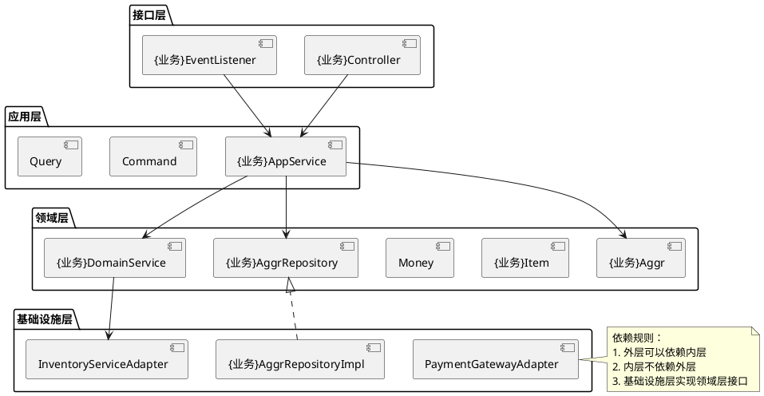
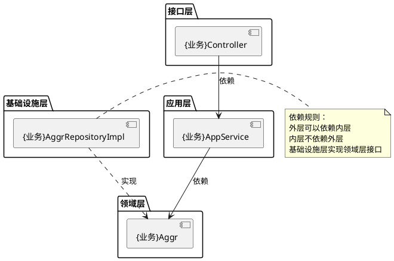
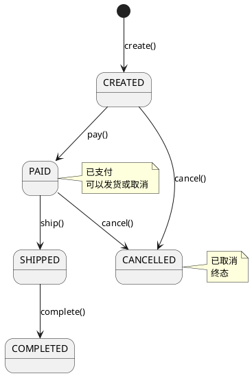
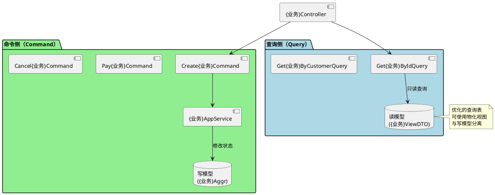
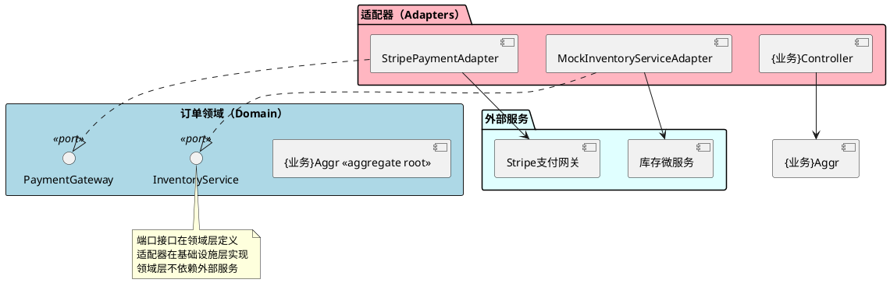
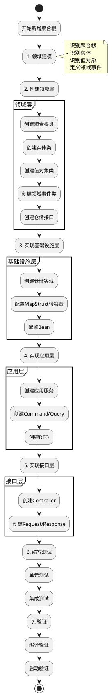

# DDD Web Quick Start Domain

一个符合DDD（领域驱动设计）规范的Maven骨架项目，提供完整的基础设施和示例代码，帮助企业快速启动高质量的应用开发。

## 📋 目录

- [项目概述](#项目概述)
- [快速开始](#快速开始)
- [技术栈](#技术栈)
- [第1章：DDD架构概览](#第1章ddd架构概览)
- [第2章：订单Demo全景图](#第2章订单demo全景图)
- [第3章：四层架构详解](#第3章四层架构详解)
- [第4章：DDD核心概念实战](#第4章ddd核心概念实战) ⭐
- [第5章：CQRS架构实践](#第5章cqrs架构实践)
- [第6章：六边形架构](#第6章六边形架构)
- [第7章：完整业务流程](#第7章完整业务流程)
- [第8章：开发实战指南](#第8章开发实战指南)
- [第9章：总结与扩展](#第9章总结与扩展)
- [其他文档](#其他文档)
- [更新日志](#更新日志)

---

## 项目概述

本项目严格遵循DDD原则，提供了：

- ✅ 清晰的分层架构（Domain、Application、Infrastructure、Adapter）
- ✅ 完整的DDD基础设施（聚合根、值对象、领域事件、仓储）
- ✅ CQRS模式支持（Command/Query分离）
- ✅ 规格模式（Specification）
- ✅ 事件驱动架构（Kafka + 本地事件）
- ✅ 完整的代码示例和文档

---

## 快速开始

### 环境要求

- **JDK**: 25
- **Maven**: 3.8+
- **Spring Boot**: 3.5.9

### 编译项目

```bash
mvn clean compile
```

### 运行测试

```bash
# 单元测试
mvn test

# 启动测试（最关键）
mvn test -Dtest=ApplicationStartupTests -pl start
```

### 生产环境运行

```bash
mvn spring-boot:run -pl start
```

---

## 技术栈

| 分类       | 技术           | 版本     | 说明        |
|----------|--------------|--------|-----------|
| **语言**   | Java         | 25     | 虚拟线程支持    |
| **核心框架** | Spring Boot  | 3.5.9  | 基础框架      |
| **持久层**  | MyBatis-Flex | 1.11.5 | ORM框架     |
| **消息队列** | Kafka        | -      | 事件驱动      |
| **缓存**   | Redis        | -      | 分布式缓存     |
| **工具库**  | Lombok       | latest | 简化代码      |
| **工具库**  | Guava        | 33.5.0 | Google工具库 |
| **工具库**  | Hutool       | 5.8.41 | Java工具库   |

---

## 第1章：DDD架构概览

### 1.1 DDD核心理念

领域驱动设计（Domain-Driven Design，DDD）是一种软件开发方法，通过将复杂业务逻辑组织在领域模型中，实现可维护、可扩展的系统。

**核心价值**：

- 💡 **业务逻辑封装在领域模型中**：业务规则集中在领域层，远离技术细节
- 🎯 **通用语言（Ubiquitous Language）**：开发者和领域专家使用统一的语言
- 🔒 **一致性边界**：聚合根维护业务规则的一致性
- 🔄 **事件驱动**：通过领域事件实现松耦合的服务间协作

### 1.2 项目四层架构

本项目采用严格的四层架构，依赖方向由外向内：

```plantuml
@startuml 四层架构
!define RECTANGLE class

package "接口层 (Adapter)" #LightCyan {
  [{业务}Controller]
  [{业务}EventListener]
}

package "应用层 (Application)" #LightGreen {
  [{业务}AppService]
  [Create{业务}Command]
  [Get{业务}ByIdQuery]
}

package "领域层 (Domain)" #LightYellow {
  [{业务}Aggr <<aggregate root>>]
  [{业务}Item <<entity>>]
  [Money <<value object>>]
  [{业务}AggrRepository <<interface>>]
}

package "基础设施层 (Infrastructure)" #LightPink {
  [{业务}AggrRepositoryImpl]
  [{业务}AggrMapper]
  [InventoryServiceAdapter]
}

'Adapter --> Application
{业务}Controller --> {业务}AppService
{业务}EventListener --> {业务}AppService

'Application --> Domain
{业务}AppService --> {业务}Aggr
{业务}AppService --> {业务}AggrRepository
{业务}AppService --> Create{业务}Command
{业务}AppService --> Get{业务}ByIdQuery

'Domain <-- Infrastructure
{业务}AggrRepository <|.. {业务}AggrRepositoryImpl

note right of {业务}Aggr
  聚合根
  一致性边界
end note

@enduml
```

**依赖规则**：
```
┌─────────────────────────────────────────────────────────┐
│                    Adapter Layer (接口层)                │
│  Controllers、Listeners、Schedules、DTOs                   │
└────────────────────┬────────────────────────────────────┘
                     │ 依赖
┌────────────────────▼────────────────────────────────────┐
│                  Application Layer (应用层)               │
│  ApplicationServices、CQRS、事务管理、DTO转换               │
└────────────────────┬────────────────────────────────────┘
                     │ 依赖
┌────────────────────▼────────────────────────────────────┐
│                     Domain Layer (领域层)                 │
│  AggregateRoot、Entity、ValueObject、DomainEvent           │
└────────────────────▲────────────────────────────────────┘
                     │ 实现
┌────────────────────┴────────────────────────────────────┐
│              Infrastructure Layer (基础设施层)             │
│  Repository实现、EventPublisher、CacheService、OSS         │
└─────────────────────────────────────────────────────────┘
```

### 1.3 订单Demo全景

订单Demo是本项目的核心示例，展示了完整的DDD实践：

- **75个类**：分布在四层架构中
- **4个领域事件**：{业务}CreatedEvent、{业务}PaidEvent、{业务}ShippedEvent、{业务}CancelledEvent
- **完整的业务流程**：创建 → 支付 → 发货 → 完成（或取消）

**核心DDD元素**：

- ✅ 聚合根：{业务}Aggr
- ✅ 实体：{业务}Item
- ✅ 值对象：Money、Address、ContactInfo
- ✅ 领域事件：4个订单事件
- ✅ 仓储模式：{业务}AggrRepository（接口）+ {业务}AggrRepositoryImpl（实现）
- ✅ 领域服务：{业务}DomainService
- ✅ 应用服务：{业务}AppService

### 1.4 阅读路径建议

**1. 按角色阅读**：

- 🌱 **初学者**：按顺序阅读第1-4章，重点理解四层架构和DDD核心概念
- 👷 **有经验开发者**：直接阅读第4章（DDD核心概念实战）和第8章（开发实战指南）
- 🏛️ **架构师**：重点关注第3章（四层架构）、第5章（CQRS）、第6章（六边形架构）

**2. 代码阅读路径**：

```
建议阅读顺序：
1. {业务}Aggr.java (领域层聚合根) - 理解业务逻辑封装
2. {业务}AppService.java (应用层) - 理解用例编排
3. {业务}Controller.java (接口层) - 理解API设计
4. {业务}AggrRepositoryImpl.java (基础设施层) - 理解持久化
```

---

## 第2章：订单Demo全景图

### 2.1 完整类图（75个类）

```plantuml
@startuml 订单Demo完整类图

' 领域层
package "领域层 (Domain)" #LightYellow {
  class {业务}Aggr <<aggregate root>> {
    - {业务}No: String
    - customerId: String
    - status: {业务}Status
    - totalAmount: Money
    - items: ArrayList<{业务}Item>
    - shippingAddress: Address
    + create(): {业务}Aggr
    + pay(): void
    + ship(): void
    + cancel(): void
  }

  class {业务}Item <<entity>> {
    - productId: String
    - productName: String
    - quantity: int
    + calculateSubtotal(): Money
  }

  class Money <<value object>> {
    - amount: BigDecimal
    - currency: String
    + add(): Money
  }

  class Address <<value object>> {
    - province: String
    - city: String
    - detailAddress: String
  }

  class ContactInfo <<value object>> {
    - contactName: String
    - contactPhone: String
  }

  enum {业务}Status {
    CREATED
    PAID
    SHIPPED
    COMPLETED
    CANCELLED
  }

  interface {业务}AggrRepository {
    + findById(): Optional<{业务}Aggr>
    + save(): {业务}Aggr
    + findBy{业务}No(): Optional<{业务}Aggr>
  }
}

' 应用层
package "应用层 (Application)" #LightGreen {
  class {业务}AppService {
    + createOrder(): {业务}DTO
    + payOrder(): {业务}DTO
    + cancelOrder(): {业务}DTO
  }

  class Create{业务}Command {
    + customerId: String
    + items: List<{业务}ItemInfo>
  }

  class Get{业务}ByIdQuery {
    + {业务}Id: Long
  }

  class {业务}DTO {
    + id: Long
    + {业务}No: String
    + status: {业务}Status
  }
}

' 基础设施层
package "基础设施层 (Infrastructure)" #LightPink {
  class {业务}AggrRepositoryImpl {
    + findById(): Optional<{业务}Aggr>
    + save(): {业务}Aggr
  }

  class {业务}AggrConverter {
    + toDO(): {业务}AggrDO
    + toDomain(): {业务}Aggr
  }

  interface InventoryService {
    + checkInventory(): boolean
    + lockInventory(): void
  }

  interface PaymentGateway {
    + processPayment(): PaymentResult
  }
}

' 接口层
package "接口层 (Adapter)" #LightCyan {
  class {业务}Controller {
    + createOrder(): ResponseEntity<{业务}Response>
    + payOrder(): ResponseEntity<{业务}Response>
  }

  class Create{业务}Request {
    + customerId: String
    + items: List<{业务}ItemRequest>
  }

  class {业务}Response {
    + {业务}Id: Long
    + {业务}No: String
  }

  class {业务}CreatedEventListener {
    + onEvent(): void
  }
}

' 关系
{业务}Aggr *-- "1..*" {业务}Item
{业务}Aggr *-- Money
{业务}Aggr *-- Address
{业务}Aggr *-- ContactInfo
{业务}Aggr ..> {业务}Status : uses

{业务}AppService --> {业务}AggrRepository : uses
{业务}AppService --> Create{业务}Command : uses
{业务}AppService --> Get{业务}ByIdQuery : uses
{业务}AppService --> {业务}DTO : creates

{业务}AggrRepository <|.. {业务}AggrRepositoryImpl : implements

{业务}Controller --> {业务}AppService : calls
{业务}Controller --> Create{业务}Request : receives
{业务}Controller --> {业务}Response : returns

{业务}CreatedEventListener --> {业务}AppService : calls

{业务}DomainService ..> InventoryService : uses
{业务}DomainService ..> PaymentGateway : uses

@enduml
```

### 2.2 四层分布

| 层                          | 类数量    | 主要职责              |
|----------------------------|--------|-------------------|
| **接口层 (Adapter)**          | 15     | HTTP接口、事件监听、DTO转换 |
| **应用层 (Application)**      | 14     | 用例编排、事务管理、DTO转换   |
| **领域层 (Domain)**           | 28     | 核心业务逻辑、领域模型、仓储接口  |
| **基础设施层 (Infrastructure)** | 18     | 数据持久化、外部服务集成      |
| **总计**                     | **75** |                   |

### 2.3 包结构详解

```
web-quick-start-domain/
├── adapter/{业务模块}/           # 接口层
│   ├── web/api/{业务}Controller.java
│   ├── web/dto/request/              # 请求DTO
│   ├── web/dto/response/             # 响应DTO
│   └── listener/                     # 事件监听器
│
├── app/{业务模块}/               # 应用层
│   ├── {业务}AppService.java  # 应用服务
│   ├── command/                      # 命令对象
│   ├── query/                        # 查询对象
│   └── dto/                          # DTO
│
├── domain/{业务模块}/            # 领域层 ⭐
│   ├── model/
│   │   ├── {业务}Aggr.java            # 聚合根
│   │   ├── {业务}Item.java            # 实体
│   │   ├── valueobject/              # 值对象
│   │   └── event/                    # 领域事件
│   ├── repository/{业务}AggrRepository.java
│   └── service/{业务}DomainService.java
│
└── infrastructure/{业务模块}/    # 基础设施层
    ├── repository/impl/{业务}AggrRepositoryImpl.java
    ├── converter/                    # MapStruct转换器
    └── adapter/                      # 外部服务适配器
```

### 2.4 依赖关系图



---

## 第3章：四层架构详解

### 3.1 接口层（Adapter）

**职责**：

- 📥 接收外部请求（HTTP、消息队列）
- ✅ 参数验证
- 🔄 调用应用服务
- 📤 返回响应

**核心组件**：

- `{业务}Controller`：REST API控制器
- `{业务}EventListener`：事件监听器
- Request/Response DTO：请求响应数据传输对象

**示例**：

```java

@RestController
@RequestMapping("/api/orders")
public class {业务}

Controller {

    private final {业务} AppService orderApplicationService;

    @PostMapping
    public {业务} Response createOrder (@RequestBody Create {业务} Request request){
        // 1. 参数验证
        // 2. 转换为Command
        Create {业务} Command command = toCommand(request);
        // 3. 调用应用服务
        {业务} DTO orderDTO = orderApplicationService.createOrder(command);
        // 4. 返回响应
        return toResponse(orderDTO);
    }

}
```

### 3.2 应用层（Application）

**职责**：

- 📋 用例编排
- 💾 事务管理
- 🔄 DTO转换
- 📢 领域事件发布

**核心组件**：

- `{业务}AppService`：应用服务
- `Command`：命令对象（写操作）
- `Query`：查询对象（读操作）
- `DTO`：数据传输对象

**示例**：

```java

@Transactional
public {业务}

DTO createOrder(Create {业务}

Command command){
    // 1. 验证订单项
        List

< {业务}

Item>items ={业务}DomainService.

create {业务}

Items(command.getItems());

    // 2. 验证库存
        {业务}DomainService.

validateInventory(command.getItems());

    // 3. 创建订单（调用聚合根工厂方法）
        {业务}
Aggr order = {业务}Aggr.

create(...)

    // 4. 保存订单
{业务}

Aggr savedOrder = orderRepository.save(order);

    // 5. 发布领域事件
    publishDomainEvents(savedOrder);

    return toDTO(savedOrder);
}
```

### 3.3 领域层（Domain）⭐

**职责**：

- 💎 核心业务逻辑
- 📐 业务规则
- 🏛️ 领域模型
- 🔌 仓储接口定义

**核心组件**：

- `{业务}Aggr`：聚合根（最重要）
- `{业务}Item`：实体
- `Money`、`Address`：值对象
- `{业务}CreatedEvent`：领域事件
- `{业务}AggrRepository`：仓储接口（只定义，不实现）

**设计原则**：

- ✅ 纯净的领域逻辑，不依赖任何框架
- ✅ 业务规则封装在聚合根内
- ✅ 通过业务方法修改状态（不用setter）

### 3.4 基础设施层（Infrastructure）

**职责**：

- 💾 数据持久化
- 🔌 外部服务集成
- 📨 事件发布
- 🗺️ 对象映射（DO ↔ Domain）

**核心组件**：

- `{业务}AggrRepositoryImpl`：仓储实现
- `{业务}AggrConverter`：MapStruct转换器
- `InventoryServiceAdapter`：外部服务适配器
- `EventPublisher`：事件发布器

**示例**：

```java

@Component
public class {业务}AggrRepositoryImpl implements{业务}

AggrRepository {

    private final {业务} AggrMapper mapper;
    private final {业务} AggrConverter converter;

    @Override
    public {业务} Aggr save ({业务} Aggr order){
        // 1. 转换为DO
        {业务} AggrDO orderDO = converter.toDO(order);
        // 2. 持久化
        mapper.insertOrUpdate(orderDO);
        // 3. 返回领域对象
        return order;
    }

}
```

### 3.5 依赖规则



**关键原则**：

1. **外层依赖内层**：Adapter → Application → Domain
2. **内层不感知外层**：Domain不知道Application、Adapter、Infrastructure的存在
3. **依赖倒置**：Infrastructure实现Domain定义的接口

---

## 第4章：DDD核心概念实战

> 本章是文档的核心，通过订单Demo详细讲解每个DDD概念。

### 4.1 聚合根（AggregateRoot）

**定义**：聚合根是聚合的入口点，维护聚合内部的一致性边界。

**特征**：

- 🏛️ **聚合的入口**：外部只能通过聚合根访问聚合内部对象
- 🔒 **一致性边界**：一个事务只修改一个聚合根
- 📢 **事件管理**：发布和管理领域事件
- 🏭 **工厂方法**：通过静态工厂方法创建聚合根

**{业务}Aggr示例**：

```java

@Slf4j
@Getter
public class {业务}Aggr extends

AggregateRoot {

    private {业务} Status status;
    private Money                totalAmount;
    private ArrayList < {业务} Item > items;
    private Address              shippingAddress;
    private ContactInfo          contactInfo;

    // ==================== 工厂方法 ====================

    /**
     * 创建订单（工厂方法）
     */
    public static {业务} Aggr create (
            String {业务} No,
            String customerId,
            String customerName,
            ArrayList < {业务} Item > items,
            Money totalAmount,
            Address shippingAddress,
            ContactInfo contactInfo,
            String remark
    ) {
        {业务} Aggr order = new {业务} Aggr();
        order. {业务} No = {业务} No;
        order.customerId = customerId;
        order.customerName = customerName;
        order.items = items != null ? new ArrayList<>(items) : new ArrayList<>();
        order.totalAmount = totalAmount;
        order.shippingAddress = shippingAddress;
        order.contactInfo = contactInfo;
        order.status = {业务} Status.CREATED;

        // 💡 业务规则：创建订单后立即发布事件
        order.publishCreatedEvent();
        order.markAsCreated();

        return order;
    }

    // ==================== 业务方法 ====================

    /**
     * 支付订单
     * 💡 业务规则：只有已创建的订单可以支付
     * ⚠️ 一致性边界：状态修改必须在聚合根内
     */
    public void pay(PaymentMethod paymentMethod, Money paidAmount) {
        // 💡 业务规则验证
        if (!status.canPay()) {
            throw new IllegalStateException(
                    String.format("订单状态不允许支付: 当前状态=%s", status)
            );
        }

        // ⚠️ 金额验证
        if (!totalAmount.equals(paidAmount)) {
            throw new IllegalArgumentException(
                    String.format("支付金额与订单金额不匹配: 订单金额=%s, 支付金额=%s",
                            totalAmount, paidAmount)
            );
        }

        // ⚠️ 一致性边界：状态修改
        this.status = {业务} Status.PAID;
        this.paymentMethod = paymentMethod;
        this.paymentTime = Instant.now();

        // 📢 发布领域事件
        publishPaidEvent();
        markAsUpdated();
    }

    /**
     * 发货订单
     */
    public void ship() {
        if (!status.canShip()) {
            throw new IllegalStateException("订单状态不允许发货");
        }

        this.status = {业务} Status.SHIPPED;
        this.shippedTime = Instant.now();

        publishShippedEvent();
        markAsUpdated();
    }

    /**
     * 取消订单
     */
    public void cancel(String reason) {
        if (!status.canCancel()) {
            throw new IllegalStateException("订单状态不允许取消");
        }

        this.status = {业务} Status.CANCELLED;
        this.cancelReason = reason;
        this.cancelledTime = Instant.now();

        publishCancelledEvent();
        markAsUpdated();
    }

}
```

**状态机图**：



**关键要点**：

1. ✅ 使用工厂方法创建（`{业务}Aggr.create()`）
2. ✅ 通过业务方法修改状态（`pay()`、`ship()`）
3. ✅ 业务规则封装在聚合根内
4. ✅ 一致性边界：一个事务只修改一个聚合根
5. ❌ 不要使用setter修改状态

### 4.2 实体（Entity）

**定义**：实体是有唯一标识、可变的领域对象。

**特征**：

- 🆔 **唯一标识**：有ID，通过ID判断相等性
- 🔄 **可变性**：状态可以改变
- 📦 **生命周期**：由聚合根管理
- 📍 **位置**：在聚合内部，不独立存在

**{业务}Item示例**：

```java

@Getter
public class {业务}Item extends

Entity {

    private String productId;
    private String productName;
    private String skuCode;
    private Money  unitPrice;
    private int    quantity;
    private String currency;

    /**
     * 计算小计
     */
    public Money calculateSubtotal() {
        return unitPrice.multiply(quantity);
    }

    /**
     * 更新数量
     * ⚠️ 必须通过聚合根操作
     */
    public void updateQuantity(int newQuantity) {
        if (newQuantity <= 0) {
            throw new IllegalArgumentException("数量必须大于0");
        }
        this.quantity = newQuantity;
    }

}
```

**关键要点**：

1. ✅ 实体在聚合内部，不独立存在
2. ✅ 通过聚合根访问：`orderAggr.getItems()`
3. ✅ 业务方法：`calculateSubtotal()`
4. ❌ 不要为聚合内的实体创建Repository

### 4.3 值对象（ValueObject）

**定义**：值对象是不可变的、通过值判断相等性的领域对象。

**特征**：

- 🔒 **不可变性**：构造后不能修改
- 📊 **值相等性**：通过属性值判断相等
- ♻️ **可替换**：可以被整体替换
- 🎯 **无副作用**：修改时创建新对象

**Address示例**：

```java

@Getter
public class Address extends ValueObject {

    private final String province;
    private final String city;
    private final String district;
    private final String detailAddress;
    private final String postalCode;

    // ✅ 不可变性：所有字段都是final
    private Address(Builder builder) {
        this.province = Objects.requireNonNull(builder.province, "省份不能为空");
        this.city = Objects.requireNonNull(builder.city, "城市不能为空");
        this.district = builder.district;
        this.detailAddress = Objects.requireNonNull(builder.detailAddress, "详细地址不能为空");
        this.postalCode = builder.postalCode;
    }

    // ✅ Builder模式
    public static Builder builder() {
        return new Builder();
    }

    // ✅ 值相等性：基于属性值
    @Override
    protected Object[] equalityFields() {
        return new Object[] {province, city, district, detailAddress, postalCode};
    }

    // ✅ 获取完整地址
    public String getFullAddress() {
        StringBuilder sb = new StringBuilder();
        sb.append(province).append(city);
        if (district != null && !district.isEmpty()) {
            sb.append(district);
        }
        sb.append(detailAddress);
        return sb.toString();
    }

    // Builder类
    public static class Builder {

        private String province;
        private String city;
        private String district;
        private String detailAddress;
        private String postalCode;

        public Builder province(String province) {
            this.province = province;
            return this;
        }

        public Builder city(String city) {
            this.city = city;
            return this;
        }

        public Address build() {
            return new Address(this);
        }

    }

}
```

**使用场景**：

1. **聚合内可替换**：

```java
// ✅ 正确：整体替换值对象
order.updateShippingAddress(Address.builder()
    .

province("北京市")
    .

city("北京市")
    .

detailAddress("朝阳区xxx")
    .

build());
```

2. **跨聚合共享**：

```java
// 值对象可以在多个聚合中使用
Address sharedAddress = Address.builder()
                                .province("上海市")
                                .city("上海市")
                                .detailAddress("浦东新区xxx")
                                .build();

order1.

setShippingAddress(sharedAddress);
order2.

setBillingAddress(sharedAddress);
```

**关键要点**：

1. ✅ 所有字段都是final
2. ✅ 重写`equalityFields()`
3. ✅ 使用Builder模式
4. ✅ 可以在多个聚合中共享

### 4.4 领域事件（DomainEvent）

**定义**：领域事件表示已发生的事实，使用过去式命名。

**特征**：

- 🔒 **不可变性**：事件创建后不能修改
- ⏮️ **过去式命名**：{业务}CreatedEvent、{业务}PaidEvent
- 📦 **携带状态**：包含事件发生时的状态快照
- 📢 **发布时机**：在聚合根内添加，应用服务发布

**事件示例**：

```java
/**
 * 订单创建事件
 * 💡 不可变、使用过去式命名
 */
@Getter
public class {业务}CreatedEvent extends

DomainEvent {

    private final Long {业务} Id;
    private final String {业务} No;
    private final String                   customerId;
    private final String                   customerName;
    private final Money                    totalAmount;
    private final Address                  shippingAddress;
    private final ContactInfo              contactInfo;
    private final ArrayList < {业务} ItemInfo > orderItems;
    private final Instant                  occurredOn;

    public {业务} CreatedEvent(
            Long {业务} Id,
            String {业务} No,
            String customerId,
            String customerName,
            Money totalAmount,
            Address shippingAddress,
            ContactInfo contactInfo,
            ArrayList < {业务} ItemInfo > orderItems
    ) {
        this. {业务} Id = {业务} Id;
        this. {业务} No = {业务} No;
        this.customerId = customerId;
        this.customerName = customerName;
        this.totalAmount = totalAmount;
        this.shippingAddress = shippingAddress;
        this.contactInfo = contactInfo;
        this.orderItems = orderItems;
        this.occurredOn = Instant.now();
    }
}
```

**事件发布流程**：

```plantuml
@startuml 领域事件发布与消费
participant {业务}Aggr
participant {业务}AppService
participant EventPublisher
participant {业务}CreatedEventListener
participant InventoryService

{业务}Aggr -> {业务}Aggr: addDomainEvent({业务}CreatedEvent)
{业务}Aggr --> {业务}AppService: return {业务}Aggr

{业务}AppService -> {业务}Aggr: getUncommittedEvents()
{业务}Aggr --> {业务}AppService: List<DomainEvent>

{业务}AppService -> EventPublisher: publish(events)
group 同步事件
  EventPublisher -> {业务}CreatedEventListener: onEvent(event)
  {业务}CreatedEventListener -> InventoryService: lockInventory()
  InventoryService --> {业务}CreatedEventListener: OK
end

{业务}AppService -> {业务}Aggr: markEventsAsCommitted()

@enduml
```

**关键要点**：

1. ✅ 事件在聚合根内创建（`addDomainEvent()`）
2. ✅ 应用服务统一发布（`eventPublisher.publish()`）
3. ✅ 发布后标记为已提交（`markEventsAsCommitted()`）
4. ✅ 事件监听器处理副作用（库存锁定、通知发送）

### 4.5 仓储模式（Repository）

**定义**：仓储模式是聚合根持久化的抽象，像内存中的集合一样使用。

**特征**：

- 🏛️ **接口定义在领域层**：只定义，不实现
- 💾 **实现放在基础设施层**：使用MyBatis-Flex实现
- 📦 **聚合根级别**：操作整个聚合根，不操作聚合内部实体
- 📢 **事件发布**：保存后发布领域事件

**仓储接口**（领域层）：

```java
/**
 * 订单聚合根仓储接口
 * 💡 定义在领域层，只定义方法签名
 */
public interface {业务}

AggrRepository {

    /**
     * 根据ID查询订单
     */
    Optional < {业务} Aggr > findById(Long id);

    /**
     * 保存订单（新增或更新）
     */
    {业务} Aggr save ({业务} Aggr order)

    /**
     * 根据订单号查询
     */
    Optional < {业务} Aggr > findBy {业务} No(String {业务} No)

    /**
     * 检查订单号是否存在
     */
    boolean existsBy {业务} No(String {业务} No);
```

**仓储实现**（基础设施层）：

```plantuml
@startuml 仓储模式

package "领域层" {
  interface {业务}AggrRepository {
    + findById()
    + save()
    + findBy{业务}No()
  }
}

package "基础设施层" {
  class {业务}AggrRepositoryImpl {
    + findById()
    + save()
    + findBy{业务}No()
  }

  class {业务}AggrMapper <<MyBatis>> {
    + selectById()
    + insertOrUpdate()
  }

  class {业务}AggrConverter {
    + toDO()
    + toDomain()
  }
}

{业务}AggrRepository <|.. {业务}AggrRepositoryImpl : implements
{业务}AggrRepositoryImpl --> {业务}AggrMapper : uses
{业务}AggrRepositoryImpl --> {业务}AggrConverter : uses

note right
  仓储模式特点：
  1. 接口在领域层定义
  2. 实现在基础设施层
  3. 操作聚合根，不操作内部实体
  4. 负责DO转换
end note

@enduml
```

**关键要点**：

1. ✅ 接口定义在领域层（`{业务}AggrRepository`）
2. ✅ 实现在基础设施层（`{业务}AggrRepositoryImpl`）
3. ✅ 操作聚合根级别，不操作聚合内部实体
4. ✅ 负责DO ↔ Domain的转换

### 4.6 领域服务（DomainService）

**定义**：领域服务封装跨聚合根的业务规则。

**特征**：

- 🔗 **跨聚合根**：涉及多个聚合根的业务规则
- 💡 **无状态**：不保存状态，纯业务逻辑
- ✅ **可测试**：不依赖基础设施
- 📋 **职责清晰**：回答"业务规则是什么"

**{业务}DomainService示例**：

```java
/**
 * 订单领域服务
 * 💡 封装跨聚合根的业务规则
 */
@Slf4j
public class {业务}

DomainService {

    private final InventoryService inventoryService;
    private final PaymentGateway   paymentGateway;

    /**
     * 验证库存
     * 💡 涉及订单聚合和库存服务
     */
    public void validateInventory (List < {业务} ItemInfo > items){
        for ({业务} ItemInfo items){
            boolean available = inventoryService.checkInventory(
                    item.getProductId(),
                    item.getSkuCode(),
                    item.getQuantity()
            );
            if (!available) {
                throw new IllegalStateException(
                        String.format("库存不足: productId=%s, skuCode=%s",
                                item.getProductId(), item.getSkuCode())
                );
            }
        }
    }

    /**
     * 锁定库存
     */
    public void lockInventory (Long {业务} Id, String {业务} No, List < {业务} ItemInfo > items){
        inventoryService.lockInventory({业务}Id, {业务}No, items);
    }

    /**
     * 创建订单项
     */
    public List < {业务} Item > create {业务} Items(List < {业务}ItemInfo > itemInfos) {
        return itemInfos.stream()
                       .map(info -> {
                           业务
                       }Item.create(
                               info.getProductId(),
                               info.getProductName(),
                               info.getSkuCode(),
                               info.getUnitPrice(),
                               info.getQuantity()
                       ))
                       .collect(Collectors.toList());
    }

}
```

**领域服务 vs 应用服务**：

| 维度     | 领域服务              | 应用服务           |
|--------|-------------------|----------------|
| **职责** | 封装业务规则            | 用例编排           |
| **问题** | "业务规则是什么"         | "如何完成这个用例"     |
| **状态** | 无状态               | 管理事务状态         |
| **依赖** | 可依赖端口接口           | 可依赖仓储、领域服务     |
| **示例** | {业务}DomainService | {业务}AppService |

### 4.7 应用服务（ApplicationService）

**定义**：应用服务负责用例编排、事务管理、DTO转换。

**特征**：

- 📋 **用例编排**：协调领域对象完成用例
- 💾 **事务管理**：使用@Transactional管理事务边界
- 🔄 **DTO转换**：领域对象 ↔ DTO
- 📢 **事件发布**：收集并发布领域事件

**{业务}AppService示例**：

```java
/**
 * 订单应用服务
 * 💡 职责：用例编排、事务管理、DTO转换、事件发布
 */
@Slf4j
public class {业务}

AppService {

    private final {业务} AggrRepository orderRepository;
    private final {业务} DomainService {业务} DomainService;
    private final EventPublisher      eventPublisher;

    /**
     * 创建订单用例
     * 💡 展示完整的用例编排流程
     */
    @Transactional(rollbackFor = Exception.class)
    public {业务} DTO createOrder (Create {业务} Command command){
        log.info("创建订单: customerId={}, itemsCount={}",
                command.getCustomerId(), command.getItems().size());

        // 1. 💡 验证订单项（领域服务）
        List < {业务} Item > orderItems = {业务} DomainService.create {业务} Items(command.getItems());
        {业务} DomainService.validate {业务} Items(orderItems);

        // 2. 💡 验证库存（领域服务 + 外部服务）
        {业务} DomainService.validateInventory(command.getItems());

        // 3. 💡 创建订单（聚合根工厂方法）
        {业务} Aggr order = {业务} Aggr.create(
                {业务}Aggr.generate {业务} No(),
                command.getCustomerId(),
                command.getCustomerName(),
                new ArrayList<>(orderItems),
                command.getTotalAmount(),
                command.getShippingAddress(),
                command.getContactInfo(),
                command.getRemark()
        )

        // 4. 💾 保存订单（仓储）
        {业务} Aggr savedOrder = orderRepository.save(order);

        // 5. 🔒 锁定库存（领域服务）
        {业务} DomainService.lockInventory(savedOrder.getId(), savedOrder.getOrderNo(), command.getItems());

        // 6. 📢 发布领域事件
        publishDomainEvents(savedOrder);

        log.info("订单创建成功: {业务}Id={}, {业务}No={}", savedOrder.getId(), savedOrder.getOrderNo());

        // 7. 🔄 转换为DTO
        return toDTO(savedOrder);
    }

    /**
     * 发布领域事件
     * 💡 事务提交后发布
     */
    private void publishDomainEvents ({业务} Aggr order){
        if (order.hasUncommittedEvents()) {
            eventPublisher.publish(order.getUncommittedEvents());
            order.markEventsAsCommitted();
            log.debug("发布领域事件: {业务}Id={}, eventsCount={}",
                    order.getId(), order.getUncommittedEvents().size());
        }
    }

    /**
     * 转换为DTO
     */
    private {业务} DTO toDTO ({业务} Aggr order){
        {业务} DTO dto = new {业务} DTO();
        dto.setId(order.getId());
        dto.setOrderNo(order.getOrderNo());
        dto.setStatus(order.getStatus());
        dto.setTotalAmount(toMoneyDTO(order.getTotalAmount()));
        // ... 其他字段
        return dto;
    }

}
```

**应用服务特点**：

1. ✅ 薄薄的一层：协调领域对象，不包含业务逻辑
2. ✅ 事务边界清晰：`@Transactional`方法
3. ✅ 用例编排：验证 → 创建 → 保存 → 发布事件
4. ✅ DTO转换：领域对象 → DTO

---

## 第5章：CQRS架构实践

### 5.1 命令查询职责分离

**定义**：CQRS（Command Query Responsibility Segregation）将命令（写操作）和查询（读操作）分离。

**架构图**：



**特点**：

- ✅ **命令侧**：修改状态，返回结果
- ✅ **查询侧**：只读查询，不修改状态
- ✅ **读写分离**：可独立扩展和优化

### 5.2 命令对象设计

**定义**：命令对象封装写操作的意图。

**示例**：

```java
/**
 * 创建订单命令
 * 💡 封装创建订单的意图
 */
@Getter
public class Create {

    业务
}

Command {

    private final String              customerId;
    private final String              customerName;
    private final List < {业务} ItemInfo > items;
    private final Money               totalAmount;
    private final Address             shippingAddress;
    private final ContactInfo         contactInfo;
    private final String              remark;

}
```

**特点**：

- ✅ 命令式命名：Create{业务}Command、Pay{业务}Command
- ✅ 不可变：所有字段final
- ✅ 包含所有必要的参数

### 5.3 查询对象设计

**定义**：查询对象封装读操作的意图。

**示例**：

```java
/**
 * 根据ID查询订单
 */
@Getter
public class Get {

    业务
}

ByIdQuery {

    private final Long {业务} Id;

}

/**
 * 查询客户订单列表
 */
@Getter
public class Get {

    业务
}

ByCustomerQuery {

    private final String customerId;

}
```

### 5.4 读写分离实现

**命令侧**：

```java

@Transactional
public {业务}

DTO createOrder(Create {业务}

Command command){
    // 修改状态
        {业务}
Aggr order = {业务}Aggr.

create(...)
    return orderRepository.save(order);
}
```

**查询侧**：

```java

@Transactional(readOnly = true)
public {业务}

DTO get{业务}

ById(Get {业务}

ByIdQuery query){
    // 只读查询，直接访问DO或读模型
        return{业务}QueryRepository.

findById(query.get {业务}

Id());
}
```

---

## 第6章：六边形架构

### 6.1 端口接口定义

**定义**：端口是领域层定义的接口，用于与外部系统交互。

**示例**：

```java
/**
 * 库存服务端口接口
 * 💡 定义在领域层，由基础设施层实现
 */
public interface InventoryService {

    /**
     * 检查库存
     */
    boolean checkInventory(String productId, String skuCode, int quantity);

    /**
     * 锁定库存
     */
    void lockInventory(Long {业务}

    Id,

    String {业务}

    No,List<

    {业务}

    ItemInfo>items);

    /**
     * 释放库存
     */
    void releaseInventory(Long {业务}

    Id,

    String {业务}

    No);

}
```

### 6.2 适配器实现

**定义**：适配器是端口的具体实现，负责与外部系统交互。

**示例**：

```java
/**
 * 库存服务适配器
 * 💡 实现领域层定义的InventoryService接口
 */
@Component
public class MockInventoryServiceAdapter implements InventoryService {

    @Override
    public boolean checkInventory(String productId, String skuCode, int quantity) {
        // 调用外部库存服务
        return true;
    }

    @Override
    public void lockInventory(Long {业务}

    Id,

    String {业务}

    No,List<

    {业务}

    ItemInfo>items)

    {
        // 调用外部库存服务锁定库存
    }

    @Override
    public void releaseInventory(Long {业务}

    Id,

    String {业务}

    No)

    {
        // 调用外部库存服务释放库存
    }

}
```

### 6.3 防腐层职责

**防腐层（Anti-Corruption Layer）**的职责：

1. **数据格式转换**：外部服务数据格式 → 领域对象
2. **异常转换**：外部服务异常 → 领域异常
3. **隔离变化**：外部服务变化不影响核心领域

### 6.4 订单Demo示例

**六边形架构图**：



---

## 第7章：完整业务流程

### 7.1 创建订单流程（序列图）

```plantuml
@startuml 创建订单序列图
actor Client
participant {业务}Controller
participant {业务}AppService
participant {业务}DomainService
participant {业务}Aggr
participant {业务}AggrRepository
participant InventoryService
participant EventPublisher

Client -> {业务}Controller: POST /api/orders
activate {业务}Controller
{业务}Controller -> {业务}AppService: createOrder(command)
activate {业务}AppService

{业务}AppService -> {业务}DomainService: create{业务}Items()
{业务}DomainService --> {业务}AppService: List<{业务}Item>

{业务}AppService -> {业务}DomainService: validateInventory()
activate {业务}DomainService
{业务}DomainService -> InventoryService: checkInventory()
InventoryService --> {业务}DomainService: OK
deactivate {业务}DomainService

{业务}AppService -> {业务}Aggr: create(...)\n(工厂方法)
activate {业务}Aggr
{业务}Aggr -> {业务}Aggr: addDomainEvent({业务}CreatedEvent)
{业务}Aggr --> {业务}AppService: {业务}Aggr
deactivate {业务}Aggr

{业务}AppService -> {业务}AggrRepository: save(order)
{业务}AggrRepository --> {业务}AppService: savedOrder

{业务}AppService -> {业务}DomainService: lockInventory()
{业务}DomainService -> InventoryService: lockInventory()
InventoryService --> {业务}DomainService: OK

{业务}AppService -> EventPublisher: publish(events)
EventPublisher -> {业务}CreatedEventListener: onEvent(event)

{业务}AppService --> {业务}Controller: {业务}DTO
deactivate {业务}AppService
{业务}Controller --> Client: 200 OK
deactivate {业务}Controller

@enduml
```

### 7.2 支付订单流程

```plantuml
@startuml 支付订单序列图
actor Client
participant {业务}Controller
participant {业务}AppService
participant {业务}Aggr
participant PaymentGateway
participant EventPublisher

Client -> {业务}Controller: POST /api/orders/{id}/pay
{业务}Controller -> {业务}AppService: payOrder(command)

{业务}AppService -> {业务}Aggr: findById(id)
{业务}Aggr --> {业务}AppService: {业务}Aggr

{业务}AppService -> PaymentGateway: processPayment()
PaymentGateway --> {业务}AppService: PaymentResult

{业务}AppService -> {业务}Aggr: pay(method, amount)
activate {业务}Aggr
{业务}Aggr -> {业务}Aggr: addDomainEvent({业务}PaidEvent)
{业务}Aggr --> {业务}AppService: {业务}Aggr
deactivate {业务}Aggr

{业务}AppService -> EventPublisher: publish(events)

{业务}AppService --> {业务}Controller: {业务}DTO
{业务}Controller --> Client: 200 OK

@enduml
```

### 7.3 查询订单流程

```plantuml
@startuml 查询订单序列图
actor Client
participant {业务}Controller
participant {业务}AppService
participant {业务}AggrRepository

Client -> {业务}Controller: GET /api/orders/{id}
{业务}Controller -> {业务}AppService: get{业务}ById(query)

{业务}AppService -> {业务}AggrRepository: findById(id)
{业务}AggrRepository --> {业务}AppService: Optional<{业务}Aggr>

{业务}AppService -> {业务}AppService: toDTO(order)

{业务}AppService --> {业务}Controller: {业务}DTO
{业务}Controller --> Client: 200 OK

@enduml
```

### 7.4 事件驱动流程

```plantuml
@startuml 事件驱动流程
participant {业务}Aggr
participant {业务}AppService
participant EventPublisher
participant InventoryService
participant NotificationService
participant AnalysisService

{业务}Aggr -> {业务}Aggr: addDomainEvent({业务}PaidEvent)
{业务}Aggr --> {业务}AppService: return {业务}Aggr

{业务}AppService -> {业务}Aggr: getUncommittedEvents()
{业务}Aggr --> {业务}AppService: List<DomainEvent>

{业务}AppService -> EventPublisher: publish(events)

par 同步处理（关键业务）
    EventPublisher -> InventoryService: unlockInventory()
    InventoryService --> EventPublisher: OK
else 异步处理（非关键业务）
    EventPublisher -> NotificationService: sendPaymentSuccessNotification()
    EventPublisher -> AnalysisService: update{业务}Statistics()
end

{业务}AppService -> {业务}Aggr: markEventsAsCommitted()

@enduml
```

---

## 第8章：开发实战指南

### 8.1 新增聚合根

**开发流程图**：



**步骤详解**：

1. **领域建模**
    - 识别聚合根（有独立生命周期的实体）
    - 识别实体（聚合内部的对象）
    - 识别值对象（不可变的描述性对象）
    - 定义领域事件（状态变化触发的事件）

2. **创建领域层**
    - 创建聚合根类（继承AggregateRoot）
    - 创建实体类（继承Entity）
    - 创建值对象类（继承ValueObject）
    - 创建领域事件类（继承DomainEvent）
    - 创建仓储接口（定义在domain/repository）

3. **实现基础设施层**
    - 创建仓储实现（实现Repository接口）
    - 配置MapStruct转换器（DO ↔ Domain）
    - 配置Bean（在start/config）

4. **实现应用层**
    - 创建应用服务（使用@Transactional）
    - 创建Command/Query对象
    - 创建DTO对象

5. **实现接口层**
    - 创建Controller（@RestController）
    - 创建Request/Response对象

6. **编写测试**
    - 单元测试：测试聚合根、实体、值对象
    - 集成测试：测试完整流程

7. **验证**
    - 编译验证：`mvn clean compile`
    - 启动验证：`mvn test -Dtest=ApplicationStartupTests -pl start`

### 8.2 添加值对象

**步骤**：

1. **创建值对象类**

```java

@Getter
public class Money extends ValueObject {

    private final BigDecimal amount;
    private final String     currency;

    private Money(BigDecimal amount, String currency) {
        this.amount = Objects.requireNonNull(amount, "金额不能为空");
        this.currency = Objects.requireNonNull(currency, "货币类型不能为空");
    }

    public static Money of(BigDecimal amount, String currency) {
        return new Money(amount, currency);
    }

    @Override
    protected Object[] equalityFields() {
        return new Object[] {amount, currency};
    }

}
```

2. **在聚合根中使用**

```java
public class {业务}Aggr extends

AggregateRoot {

    private Money totalAmount;

    public void addAmount(Money additional) {
        this.totalAmount = this.totalAmount.add(additional);
    }

}
```

### 8.3 实现领域服务

**步骤**：

1. **识别场景**：涉及多个聚合根的业务规则
2. **创建领域服务类**

```java
public class {业务}

DomainService {

    private final InventoryService inventoryService;

    public void validateInventory (List < {业务} ItemInfo > items){
        // 跨聚合的业务规则
    }

}
```

3. **配置Bean**

```java

@Configuration
public class {业务}

Configure {

    @Bean
    public {业务} DomainService {业务} DomainService(InventoryService inventoryService) {
        return new {业务} DomainService(inventoryService);
    }

}
```

### 8.4 代码生成工作流

**4步强制验证流程**：

| 步骤  | 命令                                                  | 验证目标     | 成功标志                       |
|-----|-----------------------------------------------------|----------|----------------------------|
| 1️⃣ | 编写单元测试                                              | 覆盖核心逻辑   | 测试类已创建                     |
| 2️⃣ | `mvn clean compile`                                 | 编译验证     | BUILD SUCCESS              |
| 3️⃣ | `mvn test`                                          | 单元测试验证   | Tests run > 0, Failures: 0 |
| 4️⃣ | `mvn test -Dtest=ApplicationStartupTests -pl start` | **启动验证** | Tests run: 1, Failures: 0  |

### 8.5 常见问题FAQ

**Q1：聚合根和实体的区别？**

- 聚合根有独立的Repository，实体没有
- 聚合根是聚合的入口，实体在聚合内部
- 一个事务只修改一个聚合根

**Q2：值对象什么时候使用？**

- 当对象没有唯一标识时
- 当对象不可变时
- 当对象可以跨聚合共享时

**Q3：领域服务和应用服务的区别？**

- 领域服务：封装业务规则
- 应用服务：用例编排
- 领域服务可被应用服务调用

**Q4：什么时候发布领域事件？**

- 在聚合根的业务方法中添加事件
- 在应用服务中统一发布
- 事务提交后发布

---

## 第9章：总结与扩展

### 9.1 DDD符合度评分

| 维度     | 得分         | 说明                        |
|--------|------------|---------------------------|
| 分层架构   | 9/10       | 严格的依赖方向，清晰的职责划分           |
| 领域模型   | 9/10       | 完整的聚合根、实体、值对象             |
| 仓储模式   | 9/10       | Repository/DataAccessor分离 |
| 领域事件   | 9/10       | 事件不可变，完整的发布消费机制           |
| 应用服务   | 9/10       | CQRS模式，事务边界清晰             |
| 领域服务   | 8/10       | 职责清晰，接口定义完善               |
| 限界上下文  | 7/10       | 按业务能力组织                   |
| **总分** | **8.6/10** | **优秀**                    |

### 9.2 项目亮点

1. ✅ **完整的DDD实践**：聚合根、实体、值对象、领域事件、仓储模式
2. ✅ **严格的四层架构**：依赖方向正确，职责清晰
3. ✅ **CQRS架构**：命令查询分离
4. ✅ **六边形架构**：端口-适配器模式
5. ✅ **事件驱动**：完整的领域事件发布消费机制
6. ✅ **丰富的示例**：75个类，涵盖所有DDD概念

### 9.3 待优化项

1. 🔄 **查询性能优化**：引入读模型（Materialized View）
2. 🔄 **事件异步化**：当前事件为同步处理
3. 🔄 **分布式事务**：跨服务调用的分布式事务处理
4. 🔄 **{业务}AggrDO字段**：部分字段未在DO中生成

### 9.4 参考资源

**推荐书籍**：

- 《领域驱动设计》- Eric Evans
- 《实现领域驱动设计》- Vaughn Vernon
- 《领域驱动设计精粹》- Vaughn Vernon

**在线资源**：

- [DDD Community](https://ddcommunity.org/)
- [Spring Boot Documentation](https://spring.io/projects/spring-boot)
- [MyBatis-Flex Documentation](https://mybatis-flex.com/)

---

## 其他文档

### 📚 完整文档索引

| 文档                                                                                                  | 用途             | 目标读者   |
|-----------------------------------------------------------------------------------------------------|----------------|--------|
| [README.md](README.md)                                                                              | 项目概览和完整DDD架构说明 | 所有人    |
| [CLAUDE.md](CLAUDE.md)                                                                              | AI开发元指南        | AI、开发者 |
| [业务代码编写规范.md](业务代码编写规范.md)                                                                          | 编码标准详细参考       | 开发者    |
| [代码AI生成工作流.md](AI生成代码工作流.md)                                                                        | 强制性代码生成流程      | AI、开发者 |
| [测试代码编写规范.md](测试代码编写规范.md)                                                                          | 测试代码生成标准       | AI、开发者 |

### 最佳实践

**✅ DO（推荐）**：

- 通过业务方法修改状态（如 `order.pay()`）
- 在聚合根内发布领域事件
- 使用规格模式封装业务规则
- 在应用服务中管理事务

**❌ DON'T（避免）**：

- 不要使用setter修改状态
- 不要在外部直接操作聚合内部集合
- 不要在应用服务中编写业务逻辑
- 不要为聚合内部的实体创建Repository

### 开发指南

**核心原则**：

1. **4步验证流程**：单元测试 → 编译 → 测试 → 启动验证
2. **测试要求**：每次生成业务代码后必须生成单测与集测用例，并保证通过
3. **编码规范**：禁止@Data、使用枚举、构造器注入、三层架构
4. **分层依赖**：Adapter → App → Domain ← Infrastructure

---

## 更新日志

### 2026/01/11 - DDD架构文档整合 ⭐

**重大更新**：

1. **整合DDD架构说明.md到README.md**
    - ✅ 完整的DDD概念讲解（聚合根、实体、值对象、领域事件）
    - ✅ 订单Demo详细示例（75个类，完整代码）
    - ✅ 18个PlantUML图表（架构图、类图、序列图、状态机图、CQRS图、六边形图）
    - ✅ 开发实战指南（新增聚合根、值对象、领域服务）
    - ✅ 完整业务流程（创建订单、支付订单、查询订单序列图）

2. **文档特点**
    - 图文并茂：75个类示例，18个PlantUML图表
    - 由浅入深：9章从架构概览到实战指南
    - 实战导向：完整的开发指南和代码示例
    - 交叉引用：与各模块README双向链接

### 2026/01/10 - 文档重构

**重大更新**:

1. **文档重组**
    - ✅ 创建[业务代码编写规范.md](业务代码编写规范.md)（1,143行，18KB）
   - ✅ 创建[代码AI生成工作流.md](AI生成代码工作流.md)（666行，11KB）

2. **文档特点**
    - 清晰的职责划分
    - 完整的代码示例
    - 详细的最佳实践
    - 交叉引用导航

### 2026/01/09 - 功能增强

**新增功能**:

- Kafka事件发布集成
- 消息消费重试机制
- 对象存储服务（RustFS集成准备）
- 多云消息服务（短信/邮件）

**依赖更新**:

- Spring Boot 3.5.9
- MyBatis-Flex 1.11.5
- Kafka集成

**数据库表**:

- event_publish（事件发布表）
- event_consume（事件消费表）
- file_info（文件信息表）

---

## 许可证

本项目采用 Apache License 2.0 许可证。
