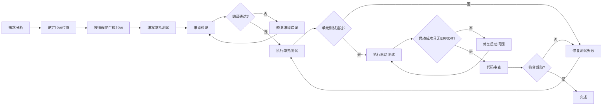

# 代码AI生成工作流

> **⚠️ 强制执行**: 本文档定义的流程必须严格遵守，任何代码生成都必须完成所有步骤
>
> **Purpose**: 定义AI代码生成的强制性工作流程和质量标准
>
> **Target Audience**: AI代码生成、开发者代码审查

---

## 📋 工作流程概览



---

## 🎯 快速参考

### 4步强制验证流程

| 步骤  | 命令                                                  | 验证目标     | ✅ 成功标志                               |
|-----|-----------------------------------------------------|----------|--------------------------------------|
| 1️⃣ | 编写单元测试                                              | 覆盖核心逻辑   | 测试类已创建                               |
| 2️⃣ | `mvn clean compile`                                 | 编译验证     | `BUILD SUCCESS`                      |
| 3️⃣ | `mvn test`                                          | 单元测试验证   | Tests run > 0, Failures: 0           |
| 4️⃣ | `mvn test -Dtest=ApplicationStartupTests -pl start` | **启动验证** | Tests run: 1, Failures: 0, Errors: 0 |

### 关键命令速查

```bash
# ===== 启动测试（最关键）=====
mvn test -Dtest=ApplicationStartupTests -pl start

# ===== 编译验证 =====
mvn clean compile

# ===== 单元测试 =====
mvn test

# ===== 查看ERROR日志 =====
mvn test -Dtest=ApplicationStartupTests -pl start | grep -i "error"
```

---

## 步骤1：编写单元测试

### 要求

- 在生成代码的同时编写单元测试
- 覆盖核心业务逻辑
- 覆盖正常分支和异常分支

### 验证标准

✅ 测试类已创建
✅ 测试方法覆盖主要场景
✅ 包含正常和异常分支

### 测试示例

```java

@ExtendWith(MockitoExtension.class)
class XxxServiceTest {

    @Mock
    private XxxRepository xxxRepository;

    @InjectMocks
    private XxxService xxxService;

    @Test
    @DisplayName("创建实体 - 成功")
    void create_Success() {
        // Given
        XxxCreateRequest request = XxxCreateRequest.builder()
                                           .name("test")
                                           .build();
        when(xxxRepository.findById(any())).thenReturn(Optional.of(new Entity()));

        // When
        Xxx entity = xxxService.create(request);

        // Then
        assertNotNull(entity);
        assertEquals(XxxStatus.CREATED, entity.getStatus());
        verify(xxxRepository, times(1)).save(any(Xxx.class));
    }

    @Test
    @DisplayName("创建实体 - 实体不存在")
    void create_EntityNotFound() {
        // Given
        XxxCreateRequest request = XxxCreateRequest.builder()
                                           .relatedId("non-existent")
                                           .build();
        when(xxxRepository.findById(any())).thenReturn(Optional.empty());

        // When & Then
        assertThrows(EntityNotFoundException.class, () -> {
            xxxService.create(request);
        });
    }

}
```

---

## 步骤2：编译验证

### 命令

```bash
# 清理并编译项目
mvn clean compile

# 或者跳过测试编译（快速验证）
mvn clean compile -DskipTests
```

### 验证要点

- ✅ 无编译错误
- ✅ 无MapStruct/Lombok警告
- ✅ MapStruct转换器正常生成
- ✅ 注解处理器正常工作

### 验证标准

✅ `BUILD SUCCESS`
✅ 无ERROR级别日志

### 常见编译问题

| 问题                 | 原因             | 解决方法                                                      |
|--------------------|----------------|-----------------------------------------------------------|
| MapStruct转换器未生成    | 注解处理器配置问题      | 检查`maven-compiler-plugin`配置，确保添加了lombok-mapstruct-binding |
| Lombok与MapStruct冲突 | 版本不兼容          | 确保lombok-mapstruct-binding版本正确（当前使用0.2.0）                 |
| 类型转换错误             | @Mapping注解配置错误 | 检查字段映射配置，使用`expression`或`ignore`                          |
| 找不到符号              | 依赖未添加          | 在根POM的`<dependencyManagement>`中添加依赖                       |

### MapStruct配置检查

确保根POM包含以下配置：

```xml

<annotationProcessorPaths>
    <path>
        <groupId>org.projectlombok</groupId>
        <artifactId>lombok</artifactId>
        <version>1.18.34</version>
    </path>
    <path>
        <groupId>org.projectlombok</groupId>
        <artifactId>lombok-mapstruct-binding</artifactId>
        <version>0.2.0</version>
    </path>
    <path>
        <groupId>org.mapstruct</groupId>
        <artifactId>mapstruct-processor</artifactId>
        <version>1.6.4</version>
    </path>
</annotationProcessorPaths>
```

---

## 步骤3：执行单元测试

### 命令

```bash
# 运行所有单元测试
mvn test

# 运行指定模块的测试
mvn test -pl domain

# 运行指定测试类
mvn test -Dtest=OrderTest

# 运行指定测试方法
mvn test -Dtest=OrderTest#testCreateOrder

# 生成测试覆盖率报告
mvn test jacoco:report
```

### 验证要点

- ✅ 所有单元测试通过
- ✅ 测试覆盖率达标
- ✅ 无跳过的测试
- ✅ 测试日志清晰可读

### 验证标准

✅ `BUILD SUCCESS`
✅ Tests run > 0
✅ Failures: 0
✅ Errors: 0

### 测试失败处理流程

1. **查看失败堆栈**: 定位失败的测试方法和原因
2. **分析失败原因**:
    - 业务逻辑错误 → 修正代码
    - 测试用例错误 → 修正测试
    - Mock配置错误 → 检查Mock设置
    - 依赖问题 → 检查依赖注入
3. **修复代码**: 根据失败原因修正
4. **重新测试**: 运行`mvn test -Dtest=FailedTest`
5. **确认修复**: 确保修复后不影响其他测试

### 测试失败示例分析

```
[ERROR] Failures:
[ERROR]   XxxServiceTest#create_EntityNotFound:30
[ERROR] Expected : EntityNotFoundException
[ERROR] Actual   : NullPointerException
```

**分析**:

- 预期抛出`EntityNotFoundException`
- 实际抛出`NullPointerException`
- 说明代码逻辑有问题，应该先检查实体是否存在

---

## 步骤4：主启动类启动验证 (⭐ **最关键**)

> **⚠️ 警告**: 此步骤验证主启动类能否成功启动，是最后一道关卡，必须100%通过才能提交代码

### 命令

```bash
# 运行ApplicationStartupTests测试类
mvn test -Dtest=ApplicationStartupTests -pl start

# 或者在IDE中直接运行测试类
# start/src/test/java/org/smm/archetype/ApplicationStartupTests.java
# 点击contextLoads()方法运行
```

### 测试原理

- `ApplicationStartupTests`测试类使用`SpringApplicationBuilder`启动主启动类`ApplicationBootstrap`
- 验证Spring上下文成功加载，所有Bean通过配置类正确初始化
- 验证Tomcat服务器成功启动
- 测试完成后立即关闭上下文，避免阻塞

### ⚠️ 启动测试必须保持纯洁

- ❌ **严格禁止**使用`@MockBean` - 启动测试应验证主启动类ApplicationBootstrap的真实Bean装配
- ❌ **严格禁止**Mock核心组件 - DataSource、RedisTemplate、KafkaTemplate等必须真实存在
- ✅ **允许Mock外部服务** - 仅允许Mock真正的外部服务（如阿里云API）
- ✅ **使用主配置文件** - 通过application.yaml验证真实环境启动

### 验证要点

- ✅ **测试类运行成功**: `ApplicationStartupTests`测试类执行
- ✅ **主启动类启动成功**: 通过测试类启动`ApplicationBootstrap`的main方法
- ✅ **Tomcat服务器启动**: 在端口9101成功启动Web服务器
- ✅ **Bean装配成功**: 所有Bean通过配置类正确初始化
- ✅ **无ERROR日志**: 检查测试输出中无ERROR级别日志
- ✅ **自动关闭上下文**: 测试完成后自动优雅关闭

### 成功标志

```
[INFO] Tomcat started on port 9101 (http) with context path '/quickstart'
[INFO] [quickstart]应用启动成功!
============================================
主启动类启动验证通过
============================================
[INFO] Tests run: 1, Failures: 0, Errors: 0
```

### 验证标准

✅ `BUILD SUCCESS`
✅ Tests run: 1
✅ Failures: 0
✅ Errors: 0

### ❌ 失败标志 - 必须修复后重试

```
[ERROR] BUILD FAILURE
[ERROR] COMPILATION ERROR
[INFO] Tests run: 1, Failures: 1, Errors: 1
Exception: BeanCreationException
Exception: NoSuchBeanDefinitionException
```

### 常见启动失败问题

| 错误类型                                | 常见原因        | 解决方法                     |
|-------------------------------------|-------------|--------------------------|
| `BeanCreationException`             | Bean依赖注入失败  | 检查配置类@Bean方法参数，确保依赖完整    |
| `NoSuchBeanDefinitionException`     | 接口未找到实现     | 检查配置类中是否有对应的@Bean方法      |
| `Autowired dependency not found`    | 循环依赖或缺少Bean | 检查配置类依赖关系，**重构代码消除循环依赖** |
| `Property placeholder not found`    | 配置文件缺失      | 检查application.yaml配置项    |
| `Failed to load ApplicationContext` | 上下文初始化失败    | 查看详细堆栈，定位具体错误Bean        |
| `Connection refused`                | 数据库/外部服务未启动 | 检查依赖服务状态，使用主配置文件         |
| `ERROR日志输出`                         | 代码逻辑错误或配置问题 | 查看ERROR日志上下文，修复问题        |

### ERROR日志检查方法

```bash
# 运行测试并查看完整日志中的ERROR
mvn test -Dtest=ApplicationStartupTests -pl start | grep -i "error"

# 或者检查Maven输出中的ERROR级别日志
# 如果出现任何ERROR，需要修复后重新验证
```

### 启动测试失败处理流程

1. **查看异常堆栈**: 找到导致失败的根异常
2. **定位问题Bean**: 根据`BeanCreationException`定位失败的Bean
3. **分析原因及解决方案**:
    - 缺少依赖 → 添加依赖或Mock
    - 循环依赖 → 必须通过重构架构、解耦代码、改进@Bean装配来解决，绝对禁止使用@Lazy等workaround
    - 配置错误 → 修正配置文件，如果是外部组件配置问题（如账号密码错误、找不到端口或地址等），则进行反馈
    - 代码错误 → 修复代码逻辑
4. **修复代码**: 根据问题类型修复
5. **重新验证**: 运行`mvn test -Dtest=ApplicationStartupTests -pl start`
6. **确认无ERROR**: 检查日志输出，确保无ERROR级别

### ⚠️ 循环依赖解决原则

**核心原则**：必须通过重构代码来解决，包括重新设计职责划分、提取公共接口、直接注入具体实现（如`@Autowired(required = false)`）、使用事件驱动解耦等。

**绝对禁止的方法**（违反文档规范）：

- ❌ 使用@Lazy注解
- ❌ 使用ObjectProvider延迟注入
- ❌ 使用ApplicationContext.getBean()依赖查找
- ❌ 使用@PostConstruct延迟初始化

### 注意事项

- ⚠️ 启动测试比单元测试慢，仅在代码生成完成后运行
- ⚠️ 使用`-pl start`指定start模块，避免运行其他模块测试
- ⚠️ 如果依赖外部服务（数据库、Kafka等），确保服务可用或使用test profile的mock配置
- ⚠️ 即使测试通过，也需检查日志中是否有WARNING，WARNING可能暗示潜在问题

---

## 代码质量检查清单

### 编译与测试验证

- [ ] 编译通过: `mvn clean compile`
- [ ] 单元测试通过: `mvn test`
- [ ] 启动测试通过: `mvn test -Dtest=ApplicationStartupTests -pl start`
- [ ] 测试覆盖率: Domain层>80%

### 架构规范检查

- [ ] 分层正确: 依赖方向符合DDD
- [ ] 接口分离: 通用服务有接口
- [ ] 枚举标准: 无魔法值
- [ ] 异常处理: 使用统一异常体系

### 代码质量检查

- [ ] 日志规范: 使用@Slf4j
- [ ] 注释完整: public方法有Javadoc
- [ ] 命名规范: 遵循Java约定
- [ ] Lombok规范: 精确使用注解

### 安全与性能检查

- [ ] 禁止事项: 不违反规范
- [ ] 安全检查: 无SQL注入等漏洞
- [ ] 性能检查: 无N+1查询等
- [ ] 配置规范: 配置正确

---

## 故障排查决策树

### 编译失败

```
编译失败
  ├─ MapStruct未生成
  │   └─ 检查注解处理器配置 → 检查lombok-mapstruct-binding版本
  ├─ 找不到符号
  │   ├─ Domain类 → 检查是否在domain模块中
  │   └─ 外部类 → 检查根POM依赖管理
  └─ 类型转换错误
      └─ 检查@Mapping注解配置
```

### 测试失败

```
测试失败
  ├─ 业务逻辑错误
  │   └─ 修正代码逻辑 → 重新测试
  ├─ Mock配置错误
  │   └─ 检查when().thenReturn()设置
  └─ 断言失败
      └─ 检查预期值与实际值
```

### 启动失败

```
启动失败
  ├─ BeanCreationException
  │   ├─ 缺少Bean → 检查配置类@Bean方法
  │   ├─ 循环依赖 → **重构代码消除循环依赖**（禁止使用@Lazy）
  │   └─ 依赖错误 → 检查@Bean方法参数
  ├─ NoSuchBeanDefinitionException
  │   └─ 接口未实现 → 检查配置类是否有@Bean方法
  ├─ Property placeholder not found
  │   └─ 配置缺失 → 检查application.yaml
  └─ Connection refused
      └─ 外部服务未启动 → 检查服务状态或配置
```

---

## 附录A: 命令快速参考

### Maven命令

```bash
# 清理并编译
mvn clean compile

# 运行所有测试
mvn test

# 运行指定模块测试
mvn test -pl domain

# 运行指定测试类
mvn test -Dtest=XxxTest

# 运行指定测试方法
mvn test -Dtest=XxxTest#testMethod

# 启动测试（最关键）
mvn test -Dtest=ApplicationStartupTests -pl start

# 查看ERROR日志
mvn test -Dtest=ApplicationStartupTests -pl start | grep -i "error"

# 依赖树检查
mvn dependency:tree

# 依赖冲突检查
mvn dependency:tree -Dverbose
```

### Git命令（仅供参考）

```bash
# 查看当前状态
git status

# 查看修改内容
git diff

# 添加文件
git add <file>

# 提交
git commit -m "message"
```

---

## 附录B: 循环依赖解决示例

### 问题示例

```
***************************
APPLICATION FAILED TO START
***************************

Description:

The dependencies of some of the beans in the application context form a cycle:

┌─────┐
|  kafkaEventPublisher
↑     ↓
|  asyncEventPublisher
↑     ↓
|  eventPublishMapper
└─────┘
```

### 正确解决方法

**1. 跨配置类依赖 - 使用构造器注入 + Optional**

```java

@Configuration
@RequiredArgsConstructor
public class InfrastructureEventConfig {

    // 可选依赖，避免循环依赖
    private final Optional<EventPublishMapper> eventPublishMapper;

    @Bean
    public KafkaEventPublisher kafkaEventPublisher(...) {
        // 处理可选依赖
        return new KafkaEventPublisher(...,eventPublishMapper.orElse(null))
    }

}
```

**2. 同配置类依赖 - 使用@Bean方法参数注入**

```java

@Configuration
public class InfrastructureEventConfig {

    @Bean
    public EventPublishMapper eventPublishMapper(...) {
        return new EventPublishMapperImpl(...)
    }

    @Bean
    public AsyncEventPublisher asyncEventPublisher(
            @Autowired(required = false) KafkaEventPublisher kafkaPublisher,
            @Autowired(required = false) SpringEventPublisher springPublisher) {
        // 使用方法参数注入，避免循环依赖
        EventPublisher delegate = (kafkaPublisher != null) ? kafkaPublisher : springPublisher;
        return new AsyncEventPublisher(delegate);
    }

}
```

### ❌ 绝对禁止的方法

```java
// ❌ 禁止：使用@Lazy
@Bean
public SomeBean someBean(@Lazy Dependency dep) { ...}

// ❌ 禁止：使用ObjectProvider
@Bean
public SomeBean someBean(ObjectProvider<Dependency> dep) { ...}

// ❌ 禁止：使用ApplicationContext
@Bean
public SomeBean someBean(ApplicationContext ctx) {
    Dependency dep = ctx.getBean(Dependency.class);
    return new SomeBean(dep);
}

// ❌ 禁止：使用@PostConstruct
@Bean
public SomeBean someBean() {
    SomeBean bean = new SomeBean();
    // 延迟初始化
    return bean;
}
```

---

## 附录C: 常见错误示例

### 编译错误

#### 错误1: MapStruct转换器未生成

```
[ERROR] cannot find symbol
  symbol:   class XxxConverterImpl
  location: class package.XxxService
```

**原因**: 注解处理器未正确配置
**解决**: 检查根POM的`maven-compiler-plugin`配置，确保添加了`lombok-mapstruct-binding`

#### 错误2: 类型转换错误

```
[ERROR] XXXMapper.java:[34,17] Can't map property "XXX XXX"
to "YYY YYY". Consider to declare/implement a mapping method
```

**原因**: 字段映射配置错误
**解决**: 使用`@Mapping(expression="java(...)")`或`@Mapping(target="...", ignore=true)`

### 测试错误

#### 错误1: Mock未生效

```
Expected : true
Actual   : false
```

**原因**: Mock对象未正确设置
**解决**: 检查`when().thenReturn()`配置，确保使用正确的mock实例

#### 错误2: 断言失败

```
org.opentest4j.AssertionFailedError: expected:<true> but was:<false>
```

**原因**: 业务逻辑错误
**解决**: 检查代码逻辑，修正业务实现

### 启动错误

#### 错误1: Bean未定义

```
org.springframework.beans.factory.NoSuchBeanDefinitionException:
No qualifying bean of type 'com.xxx.XxxService' available
```

**原因**: 配置类缺少@Bean方法
**解决**: 在配置类中添加对应的@Bean方法

#### 错误2: 循环依赖

```
The dependencies of some of the beans in the application context form a cycle
```

**原因**: 配置类Bean循环依赖
**解决**: 重构代码，使用@Bean方法参数注入或Optional包装（绝对禁止使用@Lazy）

---

**文档版本**: v1.0
**最后更新**: 2026-01-10
**维护者**: Leonardo

**相关文档**:

- [CLAUDE.md](CLAUDE.md) - AI开发元指南
- [代码编写规范.md](代码编写规范.md) - 编码规范
- [README.md](README.md) - 项目概览
